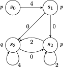
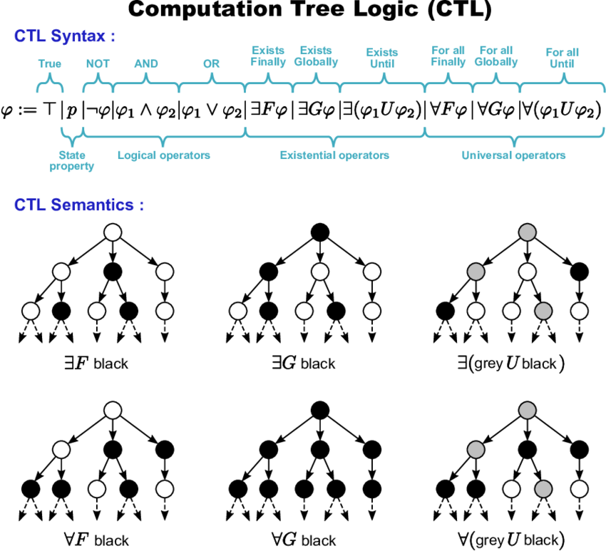
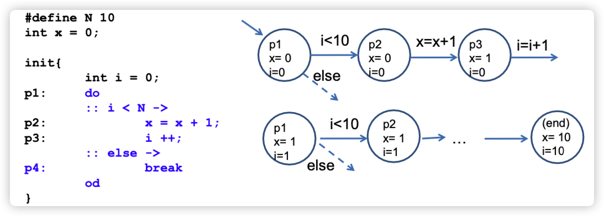

模型验证（Model Checking）是验证系统是否满足某些规格的自动化方法，在计算机科学和软件工程中非常常用。它尤其适用于并发系统的验证，如硬件设计、通信协议等。而时序逻辑是其中的重要基础，用来描述系统行为的时间属性。

> 内容参考：
>
> - E. M.Clarke, O. Grumberg, D.Peled. Model checking. 1999
> - Ю.Г.Карпов. Model checking. Верификация параллельных и распределенных программных систем // БХВ. Петербург, 2010
> - 维基百科

[toc]

# 一阶逻辑表示法

> 一阶逻辑表示法， Логика высказываний

| 数学符号            | 中文名称     | English Name           | Русское Название      | 说明                                   |
| ------------------- | ------------ | ---------------------- | --------------------- | -------------------------------------- |
| $ \land $           | 逻辑**与**   | Conjunction            | Логическое **И**      | 表示两个命题都为真                     |
| $ \lor $            | 逻辑**或**   | Disjunction            | Логическое **ИЛИ**    | 表示至少有一个命题为真                 |
| $ \neg $            | 逻辑**非**   | Negation               | Логическое **НЕ**     | 表示命题的否定                         |
| $ \rightarrow $     | 蕴含         | Implication            | Импликация            | 如果前者为真，则后者也为真             |
| $ \leftrightarrow $ | 等值         | Biconditional          | Эквивалентность       | 表示两个命题等价，即同时为真或同时为假 |
| $ \forall $         | **全称**量词 | Universal Quantifier   | Квантор всеобщности   | 对所有个体都成立的性质                 |
| $ \exists $         | **存在**量词 | Existential Quantifier | Квантор существования | 存在至少一个个体满足某个性质           |


# Kripke结构

**克里普克结构（或称Kripke结构）**是[状态迁移系统](https://zh.wikipedia.org/wiki/Transition_system)的一个变种，最初由索尔·克里普克提出，用于在模型检测中表示一个系统的行为。克里普克结构本身是一个[图](https://zh.wikipedia.org/wiki/图_(数学))，其**结点表示系统可达的状态**，**其边表示状态的迁移**。 有一个标号函数将结点与结点所具有的性质的集合映射起来。[时序逻辑](https://zh.wikipedia.org/wiki/时间逻辑)传统上是由克里普克结构进行解释的。



**注意：Kripke结构只关注状态及其之间的转换，但状态变化的条件（即导致状态转移的条件，比如图中导致状态变化的 4, 0, 2）并不直接表示在 Kripke 结构中，而是通过其他机制或额外的信息来处理。**


**形式化定义：**

设 **AP 为 原子命题的集合**，比如：包含变量、常量和谓词符号的布尔表达式。 将一个定义在 *AP* 上的克里普克结构定义为一个[四元组](https://zh.wikipedia.org/wiki/多元组) $M =(S, S_0, R, L)$，其中：

- $S$ 是有限状态集合

- $S_0 ⊆ S$ 是初始状态集合 ，有时候 $S_0$ 也被写为 $I$

- $R ⊆ S × S$ 迁移（变迁）关系，即对任意状态 $s ∈ S$，存在状态 $s'∈S$，使得 $R(s,s')$为真。其中 *R* 是一个左部满射的[多值函数](https://zh.wikipedia.org/wiki/多值函数)

    即 $∀s ∈ S, ∃s' ∈ S$ 使得 $ (s,s') ∈ R$

- $L: S →2^{AP}$ 是标记函数（或称“解释函数”） ，他标记在改状态下为真的原子命题集合

> 多值函数（英语：multivalued function, multifunction）为一数学名词，是一种二元关系。其中，定义域
> X 中的每一个元素都对应陪域 Y 中的**至少**一个元素。
>
> 

**执行路径 ρ**：表示系统的状态序列，即系统随时间的演化

**单词 ω** ：是对应执行路径上标签的序列，表示系统在每个状态下原子命题的真值。

由于 *R* 是一个[多值函数](https://zh.wikipedia.org/wiki/多值函数)，因此通过克里普克结构，总是能够构建一个无穷路径。[死锁](https://zh.wikipedia.org/wiki/死锁)状态可以建模为仅存在一条指向自身的的出边。

---

**🌰 例子 🌰**


设原子命题集合 $AP ={p, q}$。 p和q可以模拟任意可以由克里普克结构建模的系统中的布尔命题。

右图表示了一个克里普克结构 $M =(S, S_0, R, L)$，其中：

- 状态集合，$S = {S_1, S_2, S_3}$
- 初始状态集合，$S_0 = {S_1}$
- 状态转换关系，表示系统从一个状态可以转移到另一个状态。$R = {(S_1, S_2), (S_2,S_1), (S_2,S_3), (S_3、S_3)}$
- 标签函数，给每个状态分配一组原子命题。$L = {(S_1, {p, q}), (S_2, {q}), (S_3, {p})}$

**执行路径 ρ**：

Kripke 结构的**执行路径**表示系统的状态序列，即系统随时间的演化，系统运行经历过的路径。在这个例子中，执行路径 ρ 可以为：
$$
\rho = S_1, S_2, S_1, S_2, S_3, S_3, S_3, \dots
$$
这条路径表明系统首先从状态 $S_1$ 开始，接着转移到状态 $S_2$ ，然后又回到 $S_1$ ，再转移到 $S_2$ ，接着到达 $S_3$ ，并无限次保持在状态 $S_3$ 。。。。

**单词 ω** ：是对应执行路径上标签的序列，表示系统在每个状态下原子命题的真值。在这个例子中，标签序列为：
$$
ω={p,q},{q},{p,q},{q},{p},{p},{p},\dots
$$
每个集合 $\{p, q\}, \{q\}, \dots$ 对应路径上的每个状态的标签：

- 在 $S_1$ 时，标签是 {p,q}，
- 在 $S_2$ 时，标签是 {q}，
- 在 $S_3$ 时，标签是 {p}。


# 霍尔逻辑

**弗洛伊德-霍尔逻辑**（Floyd-Hoare Logic，Метод Флойда-Хоара）是由 **弗洛伊德**和**霍尔**提出的，用于**验证程序正确性**的形式化方法。这个方法主要用于证明**命令式程序**的部分正确性，尤其适用于带有**循环、条件语句**等结构的程序。

**核心思想：**

Флойда-Хоара 方法的核心是通过**逻辑断言（assertions）来描述程序在不同执行点上的状态，并通过推理规则**验证程序是否符合预期的行为。整个逻辑系统基于**霍尔三元组（Hoare Triple）**，这个三元组描述了在程序执行的不同阶段前后的条件。

## Hoare 三元组

一个 **Hoare 三元组**的形式为：
$$
\{P\} \ S \ \{Q\}
$$
其中：

- **P** 是**前置条件**（Precondition），它描述了在程序段 `S` 执行之**前**，**程序状态必须满足的条件**。
- **S** 是要执行的**程序代码段**。
- **Q** 是**后置条件**（Postcondition），它描述了在程序段 `S` 执行完毕**后**，**程序状态应当满足的条件**。

**解释**：如果在执行程序段 `S` 之前前置条件 `P` 成立，那么在执行完 `S` 之后，后置条件 `Q` 应该成立。

---

**🌰 例子 🌰**

假设我们有以下简单的程序段 `S`，它将变量 `x` 的值增加 1：

```
x = x + 1;
```

我们可以用一个 Hoare 三元组来表示该程序的执行过程：
$$
\{x = 3\} \ x = x + 1 \ \{x = 4\}
$$

解释为：“如果在执行 `x = x + 1` 之前 `x` 的值为 3，那么在执行完这行代码之后，`x` 的值应为 4

---

### 主要特点和推理规则

Флойда-Хоара логика 提供了几种用于处理不同程序结构的推理规则，如顺序执行、条件语句、循环等。下面是一些关键的推理规则：


**顺序执行规则：**

若有两个 Hoare 三元组：
$$
\{P\} S1 \{R\}

\\

\{R\} S2 \{Q\}
$$
则可以推出：
$$
\{P\} S1 ; S2 \{Q\}
$$


**条件语句规则（if-then-else）：**

对于一个条件语句：

```c
if (B) {
  S1;
} else {
  S2;
}
```

Hoare 三元组为：
$$
\{P\wedge B\} S1 \{Q\}
\\

\{P \wedge \neg B\} \ S2 \ \{Q\}
$$


可以推出：
$$
\{P\} \ \text{if (B)} \ S1 \ \text{else} \ S2 \ \{Q\}
$$


**循环不变式（Invariant）和循环规则：**

循环是程序中最复杂的部分之一，为了验证循环的正确性，Флойда-Хоара логика 引入了**循环不变式**的概念。

例如，考虑以下循环结构：

```c
while (B) {
  S;
}
```

为了验证这个循环的正确性，我们需要找到一个**循环不变式** `I`，该不变式在每次进入和离开循环体时都保持为真。推理规则为：

- **前置条件**：$\{P\} \ \text{while (B)} \ S \ \{Q\}$
- **循环不变式**：在循环的每次迭代开始之前，不变式 `I` 必须成立。
- 推理步骤：
    - **循环前置条件**：在进入循环前，不变式 `I` 应成立。
    - **循环体**：若 `B` 为真，执行 `S` 后，`I` 仍然应为真。
    - **退出条件**：若 `B` 为假，退出循环时，`I` 应能推出后置条件 `Q`。

---

**🌰 例子 🌰**

**举例说明循环不变式：**

考虑一个计算 `n` 的阶乘的程序：

```c
int fact = 1;
int i = 1;
while (i <= n) {
  fact = fact * i;
  i = i + 1;
}
```

不变式 `I` 表示 `fact` 的值为 `1 * 2 * ... * (i - 1)`，且 `i` 介于 `1` 和 `n + 1` 之间。当循环结束时，`i = n + 1`，因此 `fact = n!`。

在该例子中，循环不变式帮助我们验证整个循环是否正确工作。

---

### 总结

**弗洛伊德-霍尔逻辑** 是一种用于验证程序正确性的形式化方法。通过使用**前置条件**、**后置条件**和**推理规则**，它为程序的部分正确性提供了数学证明的工具。它广泛应用于软件工程和程序验证领域，是形式化方法的重要基础之一。


**优点：**

1. **形式化验证**：Флойда-Хоара логика 提供了验证程序的数学基础，可以证明程序满足其规范。
2. **清晰的推理过程**：通过逻辑断言清楚地描述程序的状态变化，特别适用于描述和验证复杂算法的正确性。
3. **自动化**：在现代编程中，霍尔逻辑的许多推理规则可以通过形式化验证工具（如 **ESC/Java**、**Dafny** 等）自动化实现。


**缺点：**

1. **循环和递归复杂性**：虽然霍尔逻辑处理顺序程序和简单条件语句相对容易，但对于带有复杂循环和递归的程序，找到适当的不变式可能是困难的。
2. **部分正确性**：霍尔逻辑只证明程序的部分正确性，即程序如果终止，则它满足指定的后置条件。要证明程序总是终止，还需要结合其他技术（如证明程序的**终止性**）。


---


# CTL* (CTL-Star)

从概念上看，CTL* 公式描述**计算树（Computation Tree）**的性质，计算树由 Kripke 结构生成。首先在 Kripke 结构中指定一个状态为初始状态，接着将这个结构展开成以此状态作为根的无限树。**计算树展示了从初始状态开始的所有可能的执行路径。**


**CTL***（CTL-Star，CTL*）是时序逻辑的一种扩展，它结合了 **CTL**（Computation Tree Logic，计算树逻辑）和 **LTL**（Linear Temporal Logic，线性时序逻辑）两者的表达能力。

> **CTL 和 LTL 简介**
>
> **CTL（计算树逻辑, Computation Tree Logic）**和**LTL（线性时序逻辑, Linear Temporal Logic）**是两种主要的时序逻辑，它们各自有不同的表达系统状态和行为的方式。


**CTL* 的背景和动机:**

CTL 和 LTL 是模型验证中常用的时序逻辑，它们分别用于描述系统的**并发**和**线性时间性质**。然而，它们的表达能力存在差异：

- **CTL** 允许通过**路径量词**（如 `A`、`E`）描述系统的分支行为，但对时序运算符的使用是受限的（时序运算符必须与路径量词组合使用）
- **LTL** 专注于沿**单一路径的线性时间演化**，能够自由使用时序运算符（如 `X`、`F`、`G`、`U`），但**不能**处理**分支**的未来。


为了结合两者的优点，同时增强表达能力，**CTL*** 被提出，并且它允许灵活的嵌套。CTL* 可以描述 LTL 的公式，也可以描述 CTL 的公式，还可以表达 LTL 和 CTL 各自都无法表达的更复杂的时序逻辑。

| 数学符号            | 中文名称     | English Name           | Русское Название      | 说明                                   |
| ------------------- | ------------ | ---------------------- | --------------------- | -------------------------------------- |
| $ \land $           | 逻辑**与**   | Conjunction            | Логическое **И**      | 表示两个命题都为真                     |
| $ \lor $            | 逻辑**或**   | Disjunction            | Логическое **ИЛИ**    | 表示至少有一个命题为真                 |
| $ \neg $            | 逻辑**非**   | Negation               | Логическое **НЕ**     | 表示命题的否定                         |
| $ \rightarrow $     | 蕴含         | Implication            | Импликация            | 如果前者为真，则后者也为真             |
| $ \leftrightarrow $ | 等价         | Biconditional          | Эквивалентность       | 表示两个命题等价，即同时为真或同时为假 |
| $ \forall $         | **全称**量词 | Universal Quantifier   | Квантор всеобщности   | 对所有个体都成立的性质                 |
| $ \exists $         | **存在**量词 | Existential Quantifier | Квантор существования | 存在至少一个个体满足某个性质           |

## CTL* 组成

> https://zh.wikipedia.org/wiki/%E7%BA%BF%E6%80%A7%E6%97%B6%E5%BA%8F%E9%80%BB%E8%BE%91

CTL* 公式由 **原子命题**、**布尔运算符**、 **路径量词** 和 **时序运算符** 组成。

- **原子命题（Atomic Propositions, AP）**：基本的布尔变量，如 `p`、`q`。
- **布尔运算符**：$\neg$（非）、$\wedge$（与）、$\vee$（或）、$ \rightarrow $（蕴含）、$ \leftrightarrow $ （等价）

- 路径量词描述计算树的分支结构，有 **2 种路径量词**：

| 路径量词 | 说明                                      |
| -------- | ----------------------------------------- |
| A        | 对于**所有**计算路径（**A**ll paths）     |
| E        | 对于**某些**计算路径（**E**xists a path） |

- **5 个基本时序运算符：**

    时态运算符的语义如下表所示，其中 *φ* 和 *ψ* 为原子命题(AP)变量：

| 字母表示         | 符号表示    | 中文名称  | 英文名称                 | 说明                                                         | Kripke示意图                                                 |
| ---------------- | ----------- | --------- | ------------------------ | ------------------------------------------------------------ | ------------------------------------------------------------ |
| 一元运算：       |             |           |                          |                                                              |                                                              |
| $X \varphi$      | $◯ \varphi$ | 下一个    | ne**X**t                 | *φ* 在**下一时刻**为真                                       |           |
| $F \varphi$      | $◊ \varphi$ | 最终/未来 | **F**inally / **F**uture | *φ* 在**以后某个时刻**（最终）会真                           |  |
| $G \varphi$      | $◻ \varphi$ | 全局      | **G**lobally             | 从当前时刻起，*φ* **总**是为真                               |       |
| 二元运算：       |             |           |                          |                                                              |                                                              |
| $\psi U \varphi$ |             | 直到      | **U**ntil                | *ψ* 总是为真，直到某一时刻*φ* 为真；该时刻可以为当前时刻或者以后某个时刻 |         |
| $\psi R \varphi$ |             | 释放      | **R**elease              | *φ* 总是为真，直到某一时刻*ψ*和*φ* 同时为真；如果*ψ* 从未为真，则*φ* 必须保持永远为真 | <br /> |
| $\psi W \varphi$ |             | 弱直到    | **W**eak until           | *ψ* 总是为真，直到某一时刻*φ* 为真；如果*φ* 从未为真，则*ψ* 必须保持永远为真 | <br /> |
| $\psi M \varphi$ |             | 强释放    | Strong release           | *φ* 总是为真，直到某一时刻*ψ*和*φ* 同时为真；该时刻可以为当前时刻或者以后某个时刻 |  |


## CTL* 公式：

CTL* 包含两种公式：

- **状态公式（State formulas）**：在一个特定状态上满足

    - 如果 $p \in AP$，则 $p$ 是状态公式

    - 如果 $f$ 和 $g$ 是状态公式，则 $\neg f, f \or g$ 和 $f \and g$ 是状态公式

    - 如果 $f$ 是路径公式，则 $Af$ 和 $Ef$ 是状态公式

        路径量词可以用于状态公式，如 `A φ` 或 `E φ`，其中 `φ` 是路径公式。

- **路径公式（Path formulas）**：在一条特定路径上满足
    - 如果 $f$ 是状态公式，则 $f$ 也是路径公式
    - 如果 $f$ 和 $g$ 是路径公式，则 $\neg f、 f \or g、f \and g、Xf、Ff、Gf、fUg、fRg$ 是路径公式

CTL* 是由以上规则生成的状态公式集合


# CTL（Computation Tree Logic）

CTL 是一种分支时序逻辑，它假定**时间是树形**的，**每个状态可以有多个后续状态，也就是每个状态可以有不同的未来分支。**因此，CTL 描述系统时不仅要考虑事件在时间上的顺序，还要考虑它们未来的分支可能性。

## CTL 语法:

CTL 使用**路径量词**和**时序运算符**来表达性质。

- **路径量词:**
    - `A`: 对所有路径 (All paths)
    - `E`: 存在一条路径 (Exists a path)
- **时序运算符:**
    - `X`: 在下一个状态 (ne**X**t)
    - `F`: 在将来的某个状态 (**F**uture/Eventually)
    - `G`: 在所有将来的状态 (**G**lobally)
    - `U`: 直到 (**U**ntil)



### CTL 公式例子:

- `AG p`: 在所有路径上的所有状态中，`p` 都为真（`p` 在所有未来都成立）。
- `EF p`: 存在一条路径，在该路径的某个未来状态，`p` 为真（`p` 在某个未来状态成立）。

CTL 的一个关键特性是它的表达力不仅考虑了单一未来的线性时间，还能够表达不同路径的分支未来。例如，“所有可能的未来中某个状态必须满足条件”是 CTL 能表达的一个经典性质。

# LTL（Linear Temporal Logic）

LTL 假定时间是线性的，即每个状态只有一个未来，它只能表示事件在时间上的顺序，而不考虑不同的未来分支。LTL 关注的是沿着单条路径的系统行为。

## LTL 语法:

LTL 没有**路径量词**，因为它假定只考虑单条路径上的时间演化。LTL 的时序运算符与 CTL 基本相同。

- `X p`: 在下一个状态，`p` 为真。
- `F p`: 在未来的某个状态，`p` 为真。
- `G p`: 在所有未来状态，`p` 为真。
- `p U q`: `p` 一直为真，直到 `q` 为真。

## LTL 公式例子:

- `G p`: 在所有未来状态，`p` 都为真。
- `F p`: 在将来的某个状态，`p` 会为真。

LTL 的焦点是描述系统沿单条执行路径的行为，所以它的表达力集中于线性时间的性质。

---


# **CTL 和 LTL 的比较**

CTL 和 LTL 都是描述系统动态行为的逻辑语言，但它们有一些显著区别：

1. **时间模型**:
    - CTL 使用分支时间模型，能够描述系统在不同未来路径上的行为。
    - LTL 使用线性时间模型，只能描述单条路径上的行为。
2. **表达力**:
    - CTL 能够表达的性质包含不同路径上的分支情况，因此它可以区分不同未来分支，而 LTL 不能。
    - LTL 更擅长描述系统沿一条执行路径的行为，适合线性序列的性质。
3. **公式的不同解释**:
    - CTL 公式 `AF p` 表示“在所有路径中，最终 `p` 都会发生”，即无论哪条路径，`p` 都会在某个状态为真。
    - LTL 公式 `F p` 表示“沿当前路径的某个未来状态，`p` 会为真”。
4. **常见用途**:
    - CTL 通常用于验证系统的“安全性”和“活性”，能够检查所有可能的路径。
    - LTL 则更适合检查系统在特定执行路径上的行为。

## **如何选择 CTL 还是 LTL？**

- 如果你关注的是整个系统的所有可能未来路径，使用 CTL 更合适。CTL 擅长描述系统的不同执行可能性。
- 如果你想描述系统在单条路径上的演化，如某个操作在每次执行的顺序或在某条路径上是否总能达到某个状态，LTL 是一个更简单、直接的选择。

### 模型验证中的应用

在模型验证中，CTL 和 LTL 都被用于检查系统是否满足给定的性质：

- **CTL** 通常使用**符号模型检测**，如用**NuSMV**工具验证系统的所有可能执行路径。
- **LTL** 常用于检查单条执行路径上的行为，可以通过**SPIN**这样的模型验证器来实现。

两者的工具和算法都不相同，基于系统的性质和要求，选择合适的逻辑和工具进行验证非常重要。

如果你有具体的公式或应用场景，我们可以进一步讨论如何用 CTL 或 LTL 来进行表示与验证。


# SPIN

**SPIN** 是一种利用 “On-the-Fly” 技术的用于验证并发系统的**LTL 模型检测工具**，全称为 **Simple Promela Interpreter**。它采用了显示状态枚举和偏序简约技术。主要用于验证异步软件系统，如通信协议、嵌入式系统、分布式系统以及多线程软件的正确性。SPIN 工具主要用于自动化地检测并发程序中的逻辑错误，比如**死锁、进程同步问题、资源竞争**等。

SPIN 的核心思想是基于**模型检测（Model Checking）**，它是一种自动化的验证技术，通过在状态空间中探索系统的所有可能行为，来检查是否存在不满足某种性质的情况。SPIN 使用一种称为 **PROMELA（Process Meta Language）** 的建模语言来描述系统的行为，并通过**LTL 时序逻辑**对这些系统进行验证。

在 SPIN 中，其通信命令的语法继承于 CSP。**CSP**（Communicating Sequential Processes）是一种用于描述**并发系统的形式化语言和模型**。CSP 主要关注**进程间的通信和同步**，通过定义进程如何相互作用来建模并发行为。CSP 的核心思想是将复杂的并发程序分解为相对简单的进程，通过定义它们之间的通信方式来确保正确性。

## CSP

**CSP 的基本概念：**

1. **进程**：CSP 中的基本单元是**进程**，表示执行某种操作的实体。每个进程可以独立运行，并可能与其他进程进行通信。
2. **通信**：CSP 强调进程之间通过**消息传递**进行同步与通信。进程可以通过共享的通道进行信息的发送和接收。
3. **同步**：CSP 中的通信是**同步的**，这意味着发送和接收操作必须同时发生。这种设计确保了数据的一致性和完整性。
4. **组合**：CSP 提供了多种机制来组合进程，形成更复杂的系统。这些组合可以是并行执行、选择执行或顺序执行等。


**CSP 的主要语法：**

CSP 使用一种简洁的语法来定义进程和它们的行为。

---

**🌰 例子 🌰**

如发送进程在信道 `ch` 上**发送（`!`）消息**，消息包含标签 `tg` 和值 $val_1, val_2, \dots , val_n$
$$
ch!tg(val_1, val_2, \dots , val_b)
$$
接收进程**接收（`?`）**信道 `ch` 上的消息，此消息包含标签 `tg` ，形式为
$$
ch?tg(val_1, val_2, \dots , val_n)
$$
消息包含 $n$ 个值，他们被存储在变量 $val_1, val_2, \dots , val_n$ 中。

SPIN 系统也可以传递无标签的消息。PROMELA 语言实现了利用消息队列和握手方式的消息传递方法。

---


## PROMELA 语言

SPIN 使用 **PROMELA**（**Pro**cess **Me**ta **La**nguage）来描述系统的行为。PROMELA 是一种用于描述并发系统的过程式语言，具有以下特征：

- **进程（Processes）**：PROMELA 允许用户定义多个独立的进程，这些进程可以**并发**执行，类似于线程或任务
- **通道（Channels）**：进程之间的通信可以通过**消息传递**（message passing）来实现，消息传递可以是同步的或异步的
- **控制结构**：PROMELA 支持常见的编程控制结构，如 `if-then-else`、`do-while`、`for`，以帮助描述复杂的系统行为
- PROMELA没有函数
- `init` 过程是 Promela 中的一个特殊过程，**自动运行**而无需显式启动，可以不在程序中定义，且是一个保留字。它**用于设置模型的初始状态和行为**


### 变量类型

| 变量类型   | 描述                   | 范围                                  | 适用场景                   |
| ---------- | ---------------------- | ------------------------------------- | -------------------------- |
| `bit`      | 单个位（布尔值）       | `0` 或 `1`                            | 布尔开关、开/关状态        |
| `bool`     | 布尔逻辑值             | `true` 或 `false`                     | 逻辑判断、条件标志         |
| `byte`     | 8 位无符号整数         | `0` 到 `255`                          | 小范围计数、状态标识符     |
| `short`    | 16 位有符号整数        | `-32,768` 到 `32,767`                 | 较大范围的有符号整数       |
| `int`      | 32 位有符号整数        | `-2,147,483,648` 到 `2,147,483,647`   | 复杂数值运算、计数         |
| `unsigned` | 32 位无符号整数        | `0` 到 `4,294,967,295`                | 只需要表示正整数的场景     |
| `mtype`    | 枚举类型（消息类型）   | 枚举的命名常量（如 `REQUEST`, `ACK`） | 状态、信号、消息类型标识   |
| 数组类型   | 存储多个相同类型的数据 | 取决于基础数据类型                    | 存储有序数据集合，如缓冲区 |


**溢出（Overflow）问题：**

```
byte i = 255;
i++; // i 的值会从 255 变成 0
```


### 关键字

**SPIN 系统中的条件语句：**

```pascal
if
	::guard_1 -> S_1
	::guard_2 -> S_2
	.
	.
	.
	::guard_n -> S_n
fi
```


**SPIN 系统中的循环语句：**

```pascal
do
	::guard_1 -> S_1
	::guard_2 -> S_2
	.
	.
	.
	::guard_n -> S_n
od

do
:: условие -> список команд
:: условие -> список команд
…
:: условие -> список команд
od

---------------- 比如 ----------------
init {
	int i = 0;
	do
	:: i < N ->
							x = x + 1;
							i ++;
	:: else -> break
	od
}
```

每一个 `guard` 可以由一个条件或一个通信命令组成，也可以由他们两个组成。

当执行 if 或者 while 语句的时候，将不确定的选择一个可通过的 $guard_i$，然后开始执行对应的命令 $S_i$。do 循环至于在遇到 goto 命令或者 break 命令的时候才停止，goto 命令强迫执行跳转到指定的 label 的一行，而 break 命令在当前循环执行完毕后，跳转出本层循环体。

---

**`proctype` 关键字：**

`proctype` 是 Promela 中用于**定义进程类型**的关键字。它类似于定义一个函数或类，可以通过 `run` 或 `active` 来启动。通过 `proctype`，你可以定义进程的行为逻辑，以便并发执行。

```pascal
proctype MyProcess() {
    // 进程逻辑
}
```

这个定义创建了一个名为 `MyProcess` 的进程，之后可以用来生成并发进程实例。


---

**`init` 关键字：**

- **`init` 是一个特殊的进程**，它在模型执行时自动启动，无需显式调用或手动运行。类似于程序的入口
- `init` 过程的主要作用是定义模型的初始条件，设置共享变量，或者启动其他进程
- 一个 Promela 模型中可以没有 `init`，但如果定义了，**它将自动成为第一个被执行的过程**

```
// 在这里，init 是模型开始时自动执行的，没有任何显式的启动动作
init {
    // 初始行为，例如变量赋值
}
```

---

**`run`关键字：**

- **`run` 用于启动基于 `proctype` 定义的新进程实例**。可以在 `init` 或其他进程中使用 `run` 关键字
- 通过 `run`，可以动态地启动一个或多个进程，让这些进程并发执行

```
proctype MyProcess() {
    // 进程逻辑
}

// 在这个例子中，init 会首先被执行，然后通过 run 关键字启动两个 MyProcess 实例，两个进程将并发运行
init {
    run MyProcess(); // 使用 run 启动 MyProcess 进程
    run MyProcess(); // 再次启动一个 MyProcess 进程（并发执行）
}
```


---

**`active` 关键字：**

- `active` 关键字用于表示一个进程在模型开始执行时会被**自动激活和运行**。换句话说，当你定义一个进程并使用 `active` 关键字时，这个进程就会被**立即启动，而不需要手动使用 `run` 操作符来启动它**

```pascal
// ↓  MyProcess 在模型开始时就会被直接运行，而无需额外启动它
active proctype MyProcess() {
    // 进程逻辑
}
```


`active[n]` 在 Promela 中**表示定义和激活 n 个并发进程**。具体来说，这行代码会创建 n 个 `active` 进程的实例，它们会同时执行。

```pascal
// 这会启动两个 MyProcess 的并发实例，它们同时运行
active[2] proctype MyProcess() {
    // 进程逻辑
}
```


---

**`atomic` 关键字：**

`atomic` 是一个用于定义**原子操作**的关键字。它的作用是将一组语句打包成一个不可中断的整体，一旦开始执行，就会全部执行完毕，且不会被其他进程的调度中断。

在 `atomic` 块执行期间，**只有一个线程**（或进程）可以执行其中的操作，其他线程会被阻塞，直到这个原子操作完成。这确保了共享数据只能由这个线程进行操作，从而避免了数据竞争和不一致性的问题。

```pascal
atomic {
    x = x + 1;
    y = y - 1;
}
```

在上面的代码中，`x = x + 1;` 和 `y = y - 1;` 被包在 `atomic` 里，这意味着这两条语句会被视为一个整体，在执行的过程中不会被其他进程插入或干扰。

---

**🌰 例子 🌰**

以下是一个简单的 PROMELA 示例，描述两个进程通过消息通道进行通信：

在这个示例中，有两个进程：`sender` 和 `receiver`，它们通过名为 `message` 的通道进行通信。发送进程向通道中发送一个整数 42，而接收进程从通道中接收该整数。

```c
chan message = [0] of {int}; // 定义一个消息通道

// proctype 定义一个进程
proctype sender() {
  message!42;  // 发送消息 42
}

proctype receiver() {
  int received;
  message?received;  // 接收消息
}

init {
  run sender();   // 使用 run 启动发送进程
  run receiver(); // 使用 run 启动接收进程
}
```


## 综合示例

**🌰 例子 🌰**

综合性的 Promela 示例：包括 `#define`、全局变量、局部变量、`init`、`proctype`、`run`、`atomic` 等关键字。

这个示例展示了一个简单的生产者-消费者模型，它展示了如何使用 **Promela** 模拟两个独立的进程（生产者和消费者）在共享一个缓冲区时的相互协作。具体来说，生产者不断产生新的数据并存放到缓冲区，而消费者则从缓冲区中取出数据进行处理。这是一个经典的并发问题，主要用来说明**同步**和**互斥**问题，通常通过控制缓冲区来避免竞争条件或数据丢失。


**生产者进程 (Producer)**：

- 生产者负责**产生数据**并存放到**共享缓冲区**中
- 当缓冲区未满时，生产者将新的数据加入缓冲区
- 如果缓冲区已满，生产者则需要等待，直到缓冲区有空位


**消费者进程 (Consumer)**：

- 消费者负责**消费数据**，即从共享缓冲区中取出数据
- 当缓冲区不为空时，消费者从中取走一个数据
- 如果缓冲区为空，消费者需要等待，直到有数据可以消费


**在生产者和消费者之间的协作中，有两个核心问题需要解决：**

- **同步问题**：当缓冲区为空时，消费者需要等待生产者生产新的数据；当缓冲区满时，生产者需要等待消费者消耗数据以腾出空间。
- **互斥问题**：因为缓冲区是共享资源，所以在对缓冲区进行增删操作时，必须保证这些操作的原子性，避免多个进程同时修改缓冲区导致的数据不一致


```promela
#define BUFFER_SIZE 3   // 使用 #define 定义常量

byte buffer[BUFFER_SIZE]; // 定义全局数组，作为缓冲区
byte count = 0;           // 全局变量，用于追踪缓冲区中的项数

// 生产者进程类型
proctype Producer() {
    byte i = 0; // 局部变量 i，表示生产的次数
    do
    :: (count < BUFFER_SIZE) ->     // 如果缓冲区未满
        atomic {                    // 使用 atomic 保证操作不被打断
            buffer[count] = i;      // 将值存入缓冲区
            count++;                // 更新缓冲区计数
            printf("Producer: produced item %d\n", i);
            i++;
        }
    od
}

// 消费者进程类型
proctype Consumer() {
    byte j; // 局部变量 j，表示消费的次数
    do
    :: (count > 0) ->               // 如果缓冲区不为空
        atomic {                    // 使用 atomic 保证操作不被打断
            j = buffer[count-1];    // 从缓冲区中取出一个值
            count--;                // 更新缓冲区计数
            printf("Consumer: consumed item %d\n", j);
        }
    od
}

// 初始化进程
init {
    // 使用 run 启动一个生产者和一个消费者进程
    run Producer();
    run Consumer();
}
```


每个 Promela 模型都可以看作是一个 **Kripke 结构**，也就是一个带标记的状态转换系统。它描述了系统的所有可能状态，以及状态之间的转换关系，用标记来描述每个状态的特征。这种结构可以用来验证和分析系统的行为。

比如以下展示了 Promela 到 Kripke 的转换：



- 系统状态由全局和局部变量的值以及操作符的标签构成
- 状态之间的转换发生在程序的操作符上
- 当在某个状态下操作符可以被执行时，就可以进行状态转换
- 在模拟过程中，会执行 Kripke 结构中的一种可能计算
- 在验证过程中，会检查 Kripke 结构中的所有可能计算


## 可执行性和不可执行性

> **выполнимость** - 可执行性

- 在 **SPIN** 中，**所有的操作符 (оператор)**在执行之前都会进行检查，确保它们是**可以执行的**。
- 有一些特殊的操作符不需要检查是否可执行，因为它们**总是可以执行**，包括：
    - **`skip`**：表示“什么都不做”，它没有任何前提条件，总是可以执行。
    - **`break`**：用于跳出循环，也没有条件限制。
    - **`printf`**：用于输出调试信息，也不会受到条件的限制，因此也总是可执行的。
- 如果某个操作符在当前状态下**无法执行**，那么这个进程就会**被阻塞 (процесс заблокируется)**，也就是进入等待状态，直到操作符变得可执行

---

**🌰 示例 1：**可执行的，i 将由 0 变为 1

```
byte i = 0;
  active proctype Q() {
  i++;
}
```

---

**🌰 示例 2：**不可执行，`i == 2`，将不可执行，因为 i 为 0

```
byte i = 0;
active proctype Р() {
  (i == 2);  // 进程永久阻塞在这里
  printf(“Hello i=%d”, i);
}
```

这段代码中的进程会**一直阻塞**，因为它包含了一个条件检查 `(i == 2)`，而初始时 `i` 的值为 `0`，这个条件始终为**假**，导致进程无法继续执行。


---

**🌰 示例 3：**异步程序的数据同步问题 (Синхронизация по данным)

这个示例综合了之前的示例 1 和 2。

```
byte i = 0;  // глобальная переменная

active proctype Q() {
  i++;
  i++
}

active proctype Р() {
  (i == 2);  // 临时阻塞
  printf(“Hello i=%d”, i);
}
```

进程 P 会在检查到条件时阻塞，并等待.... 直到进程 Q 更改变量 i，然后两个进程都将**成功**终止！


