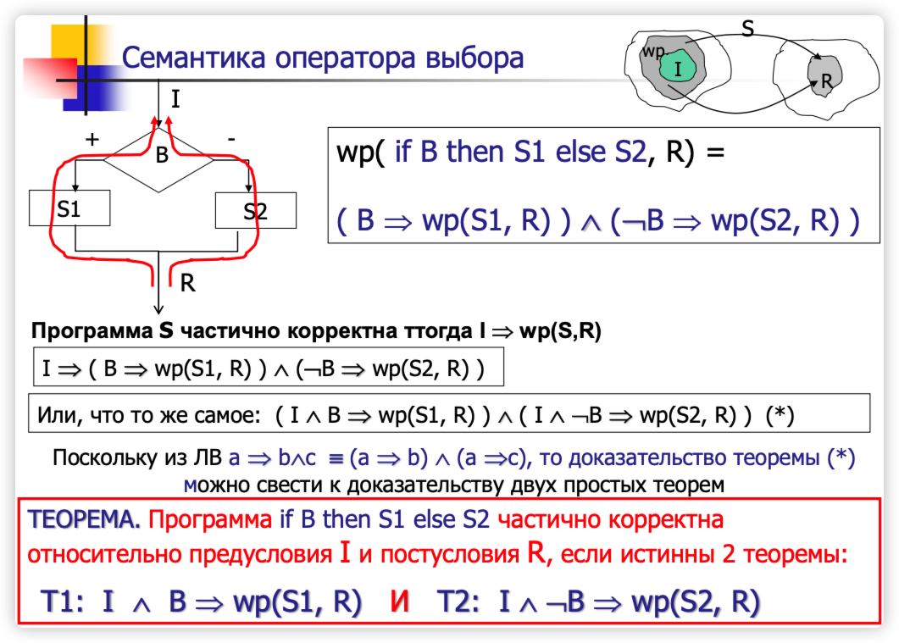
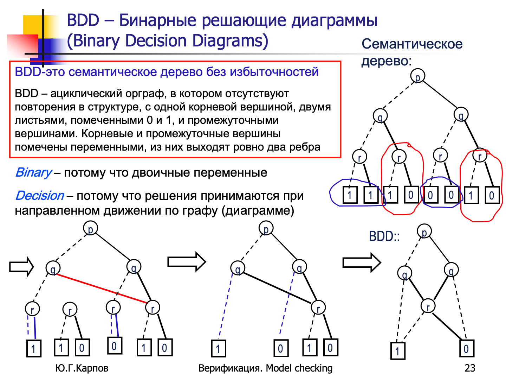

模型验证（Model Checking）是验证系统是否满足某些规格的自动化方法，在计算机科学和软件工程中非常常用。它尤其适用于并发系统的验证，如硬件设计、通信协议等。而时序逻辑是其中的重要基础，用来描述系统行为的时间属性。

> 内容参考：
>
> - E. M.Clarke, O. Grumberg, D.Peled. Model checking. 1999
> - Ю.Г.Карпов. Model checking. Верификация параллельных и распределенных программных систем // БХВ. Петербург, 2010
> - http://wasp.iis.nsk.su/
> - 维基百科

[toc]

# 一阶逻辑表示法

> 一阶逻辑表示法， Логика высказываний

| 数学符号                 | 中文名称     | English Name           | Русское Название      | 说明                                                         |
| ------------------------ | ------------ | ---------------------- | --------------------- | ------------------------------------------------------------ |
| $ \land $                | 逻辑**与**   | Conjunction            | Логическое **И**      | 表示两个命题都为真                                           |
| $ \lor $                 | 逻辑**或**   | Disjunction            | Логическое **ИЛИ**    | 表示至少有一个命题为真                                       |
| $ \neg $                 | 逻辑**非**   | Negation               | Логическое **НЕ**     | 表示命题的否定                                               |
| $ \rightarrow $          | 蕴含         | Implication            | Импликация            | 如果前者为真，则后者也为真                                   |
| $ \leftrightarrow $(iff) | 等值         | Biconditional          | Эквивалентность       | 表示两个命题等价，即同时为真或同时为假<br />iff 表示"**if and only if**"，即“**当且仅当**”。 |
| $ \forall $              | **全称**量词 | Universal Quantifier   | Квантор всеобщности   | 对所有个体都成立的性质                                       |
| $ \exists $              | **存在**量词 | Existential Quantifier | Квантор существования | 存在至少一个个体满足某个性质                                 |


## 谓词 (Предикат)

**形式**：

- 谓词通常用字母表示，如 $P(x)$，其中 $P$ 是谓词，$x$ 是一个变量。
- 例如，谓词$P(x)$ 可以表示“$x$是偶数”。对于某个具体的 $x$，该谓词返回真或假。

函数从**某个集合（状态）**映射到布尔值 $\{T, F\}$（真或假）称为**谓词**。谓词用于判断某个条件是否成立。

通过谓词，可以定义一个集合 $D_P$ 如下：
$$
D_P := \{x \mid x \text{ 满足性质 } P\}
$$
这个集合 $D_P$ 包含了所有使得谓词 \(P\) 返回真值的元素。


例如，谓词 \(a > b\) 定义了所有满足条件的数对 $\langle a, b \rangle$，即所有使得 \(a\) 大于 \(b\) 的数对

---

### 谓词的强弱比较

==**定义**：谓词 Q 被称为比 R 强，如果当 Q 为真时，R 也为真，但它们并不完全等价。==

**形式化表达**：如果 $Q$ 为真，则 $R$ 一定为真，表示为：  
$$
Q(强) \Rightarrow R(弱)
$$
这意味着满足 $Q$ 的所有情况，必然也满足 $R$。**也就是强的条件范围要小一些，弱的条件可以覆盖更多的条件（一点点条件就可以让他为真）**

**特别说明：** 

- **True**：最**弱**的条件，它总是成立 (6самое слабое условие (слабейший предикат))
- **False**：最强的条件，因为没有任何值能使它为真 (самое сильное условие (сильнейший предикат))


**🌰 例子 🌰**


条件 $x > 2$ 比条件 $x > 0$ 更**强**。原因是，如果 $x > 2$，那么必然满足 $x > 0$。 - 也就是说，满足 $x > 2$ 的所有数都同时满足 $x > 0$，但满足 $x > 0$ 的数并不一定满足 $x > 2$


**🌰 例子 🌰**

**Q(x)**：三角形 $x$ 是等边三角形

**R(x)**：三角形 $x$ 是等腰三角形。

**解释**：如果一个三角形是等边三角形（所有边相等），那么它必然是等腰三角形（至少有两条边相等），但反过来不成立——等腰三角形不一定是等边三角形。


---

**量词**：

- 谓词常常与量词结合使用，如全称量词（$\forall$）和存在量词（$\exists$）。
- 例如，句子“所有偶数都是整数”可以用谓词表示为 $\forall x (P(x) \rightarrow Q(x))$，其中 $P(x)$ 表示“$x$ 是偶数”，$Q(x)$ 表示“$x$是整数”。


**谓词的作用：**

1. **描述子集**：

    - 谓词可以用来描述某个集合的子集，包括无限集合。例如，谓词 $x > y$ 描述了所有满足 $x$ 大于 $y$ 的数对。这表示的是一个无穷的数对集合。

    

**🌰 例子 🌰**

- 以谓词 $z + 2x = y$ 为例，它定义了所有三元组 $\langle x, y, z \rangle$，其中 $z + 2x$ 等于 $y$。这说明通过这个关系，可以得到一组特定的 $x, y, z$ 值。
- 例如，三元组 $\langle 51, 136, 17 \rangle$ 满足这个关系，因为 $17 + 2 \times 51 = 119$；而 $\langle 12, 153, 5 \rangle$ 则不满足，因为 $295+2×12=29$

以上说明中的 $<x, y, z>$，被称为**状态（Состояние）**


# 霍尔逻辑

> 霍尔逻辑也就是演绎验证（дедуктивной верификации）

**弗洛伊德-霍尔逻辑**（Floyd-Hoare Logic，Метод Флойда-Хоара）是由 **弗洛伊德**和**霍尔**提出的，用于**验证程序正确性**的形式化方法。这个方法主要用于证明**命令式程序**的部分正确性，尤其适用于带有**循环、条件语句**等结构的程序。

**核心思想：**

Флойда-Хоара 方法的核心是通过**逻辑断言（assertions）来描述程序在不同执行点上的状态，并通过推理规则**验证程序是否符合预期的行为。整个逻辑系统基于**霍尔三元组（Hoare Triple）**，这个三元组描述了在程序执行的不同阶段前后的条件。

在 **霍尔逻辑** 中，程序的规范可以通过两种形式来描述：**部分正确性（Partial Correctness）** 和 **完全正确性（Total Correctness）**。它们用于描述程序在执行时的行为，并定义程序在满足特定条件时的正确性。


## Hoare 三元组

> **тройка Хоара** - 霍尔三元组
>
> **пре**дусловие - 前置条件
>
> **пос**тусловие - 后置条件
>
> Частичная корректность - 部分正确性
>
> Полная/тотальная корректность - 完全正正确性

一个 **Hoare 三元组**的形式为：
$$
\{P\} \ S \ \{Q\}, 部分正确性（Partial \ Correctness）
\\
[P] \ S \ [Q], 完全正确性（Total \ Correctness）
$$
其中：

- **P** 是**前置条件**（Precondition，предусловие），它描述了在程序段 `S` 执行之**前**，**程序状态必须满足的条件**。
- **S** 是要执行的**程序代码段**。
- **Q** 是**后置条件**（Postcondition，постусловие），它描述了在程序段 `S` 执行完毕**后**，**程序状态应当满足的条件**。

**解释**：如果在执行程序段 `S` 之前前置条件 `P` 成立，那么在执行完 `S` 之后，后置条件 `Q` 应该成立。

如果 $\{P\} \ S \ \{Q\}$ 为真，这意味着：

- 在程序 $S$ 执行之前，前置条件 $P$ 必须满足；
- 在 $P$ 成立的情况下，程序 $S$ 将按照预期执行；
- 程序执行完后，最终状态会满足后置条件 $Q$。

换句话说，前置条件 $P$ 是进入程序的“起点”，而后置条件 $Q$ 是程序运行后希望达到的“终点”。


---

**部分正确性（Partial Correctness, Частичная корректность）**：
$$
\{ I \} P \{ R \}
$$
解释：如果程序 P 在开始执行之前满足前置条件 I，并且程序 P 最终**成功终止**，那么执行完毕后程序的状态将满足后置条件 R。

**关键点**：部分正确性**不保证**程序 P 一定会终止，只是在**终止的情况下**，保证最终的状态满足后置条件 R。

---

**完全正确性（Total Correctness, Полная/тотальная корректность）**：
$$
[ I ] P [ R ]
$$


解释：如果程序 P 在开始执行之前满足前置条件 I，**那么程序 P 一定会终止**，并且在终止后，程序的状态将满足后置条件 R。

**关键点**：完全正确性除了保证在终止时满足后置条件 R，还**额外保证程序 P 会终止**。


---

**🌰 例子 🌰**

假设我们有以下简单的程序段 `S`，它将变量 `x` 的值增加 1：

```
x = x + 1;
```

我们可以用一个 Hoare 三元组来表示该程序的执行过程：
$$
\{x = 3\} \ x = x + 1 \ \{x = 4\}
$$

解释为：“如果在执行 `x = x + 1` 之前 `x` 的值为 3，那么在执行完这行代码之后，`x` 的值应为 4

---

**🌰 部分/完全正确性例子 🌰**

**部分正确性**：如果在程序 P 开始之前变量 `x = 1`（前置条件 I），且 P 完成后变量 `x` 应等于 2（后置条件 R），那么我们可以描述为 `{ x = 1 } P { x = 2 }`，但部分正确性并不保证程序 P 一定会终止。

**完全正确性**：同样的场景，如果我们要确保程序 P **一定会终止**并且 `x = 2` 是最终的结果，则使用 `[ x = 1 ] P [ x = 2 ]` 来描述。

---


### 主要特点和推理规则

Флойда-Хоара логика 提供了几种用于处理不同程序结构的推理规则，如顺序执行、条件语句、循环等。下面是一些关键的推理规则：


---

**规则前提**


如果 $P \Rightarrow P1$ 并且 $\{P1\} S \{Q1\}$，而且 $Q1 \Rightarrow Q$，那么可以推出 $\{P\} S \{Q\}$

这意味着如果一个状态 $P$ 能推出 $P1$，并且在程序执行后状态能够推出 $Q$，那 么整个程序的前置条件和后置条件之间的逻辑推导就成立

**在这里用了谓词比较的强弱，$P \Rightarrow P1$ 说明 P 比 P1 要强；同理 $Q1 \Rightarrow Q$ 说明 Q1 比 Q 强，也就是 Q 比 Q1 弱**


---

**顺序组合规则（Composition Rule）**：

对于顺序执行的两个程序 $S1$ 和 $S2$，如果 {P} S1 **{P1}** 且 **{P1}** S2 {Q}，那么可以得出 {P} **S1; S2** {Q}。

这个规则表示程序的执行是顺序的，如果前半部分程序执行后能够到达中间状态 $P1$，后半部分程序再从 $P1$ 开始执行，最终可以达到 $Q$，那么整个程序的正确性得以证明


**🌰 例子 🌰**

若有两个 Hoare 三元组：
$$
\{P\} S1 \{R\}

\\

\{R\} S2 \{Q\}
$$
则可以推出：
$$
\{P\} S1 ; S2 \{Q\}
$$

---

**条件语句规则（Conditional Rule）**：

对于条件语句 $\text{if B then S1 else S2 fi}$，需要分别证明两个分支：

- 在条件 $B$ 为真时，程序 $S1$ 执行并满足 $\{P \land B\} S1 \{Q\}$。
- 在条件 $B$ 为假时，程序 $S2$ 执行并满足 $\{P \land \neg B\} S2 \{Q\}$。

如果这两个分支都能推出最终的后置条件 $Q$，那么整个条件语句的正确性得以保证。


**🌰 例子 🌰**

对于一个条件语句：

```c
if (B) {
  S1;
} else {
  S2;
}
```

Hoare 三元组为：
$$
\{P\wedge B\} S1 \{Q\};
\\

\{P \wedge \neg B\} \ S2 \ \{Q\}
$$


可以推出：
$$
\{P\} \ \text{if (B)} \ S1 \ \text{else} \ S2 \ \{Q\}
$$

---

**循环不变式（Invariant）和循环规则：**

其中 A 是一个循环不变式
$$
\{A∧B\}S\{A\}⇒\{A\}while \ B \ do \ S \ od \{A∧¬B\}
$$


循环是程序中最复杂的部分之一，为了验证循环的正确性，Флойда-Хоара логика 引入了**循环不变式**的概念。

例如，考虑以下循环结构：

```c
while (B) {
  S;
}
```

为了验证这个循环的正确性，我们需要找到一个**循环不变式** `I`，该不变式在每次进入和离开循环体时都保持为真。推理规则为：

- **前置条件**：$\{P\} \ \text{while (B)} \ S \ \{Q\}$
- **循环不变式**：在循环的每次迭代开始之前，不变式 `I` 必须成立。
- 推理步骤：
    - **循环前置条件**：在进入循环前，不变式 `I` 应成立。
    - **循环体**：若 `B` 为真，执行 `S` 后，`I` 仍然应为真。
    - **退出条件**：若 `B` 为假，退出循环时，`I` 应能推出后置条件 `Q`。

**通常来讲 I 就是 B？**

---

**🌰 例子 🌰**

**举例说明循环不变式：**

考虑一个计算 `n` 的阶乘的程序：

```c
int fact = 1;
int i = 1;
while (i <= n) {
  fact = fact * i;
  i = i + 1;
}
```

不变式 `I` 表示 `fact` 的值为 `1 * 2 * ... * (i - 1)`，且 `i` 介于 `1` 和 `n + 1` 之间。当循环结束时，`i = n + 1`，因此 `fact = n!`。

在该例子中，循环不变式帮助我们验证整个循环是否正确工作。

---


## 非逻辑公理

**赋值公理**：

当对变量 `x` 赋值为表达式 `E` 时，用于描述赋值后前置条件如何变化。

例如： $\{P_{x \leftarrow E} \} x := E \{ P \}$ 或者记作 $\{ P (x / E) \} x := E \{ P(x) \}$ 

这里表示的是，在进行赋值 `x := E` 之后，我们把表达式 `E` 的值代入到原始条件中，以得到新的状态。


两个非逻辑公理的例子，这些公理是关于**最大公约数（НОД）**的性质：

- A1：$ (\forall x) \ НОД(x, x) = x $

    这是描述最大公约数的一个简单性质：对于任意的 $x$，$НОД(x, x)$ 等于 $x$ 本身。

    

- A2：$ (\forall x, y) \ [ (x > y) \Rightarrow НОД(x, y) = НОД(x - y, y) ] $

    这是描述最大公约数的递归性质：对于任意的 $x$ 和 $y$，如果 $x > y$，那么 $НОД(x, y)$ 等于 $НОД(x - y, y)$。这实际上是欧几里得算法的一个步骤。

这些“非逻辑公理”补充了程序验证中的纯逻辑推导，帮助我们证明涉及具体数学运算的程序的正确性。


## sp 强后置条件 (Сильнейшее постусловие)

> **定理**：程序 P 相对于前置条件 I 和后置条件 R 是部分正确的，当且仅当 $sp(P, I) \Rightarrow R$

$$
\{I\}P\{R\}⟺sp(P,I)⇒R
$$

**最强后置条件（Strongest Postcondition, SP）**是程序 P 在执行后能确保的**最严格的状态**。换句话说，最强后置条件是描述程序 P 执行后所有可能的最终状态的条件。它表示程序终止时所能达到的最大可能的效果。


**形式化定义**：最强后置条件 $sp(P, I)$ 是在程序 P 结束后，所有能够从满足前置条件 I 的状态转换到的状态。

换句话说，如果程序的初始状态满足前置条件 I，那么在程序 P 执行之后，最终的状态会满足最强后置条件 $sp(P, I)$ 


**由此我们可以得出：**

- `{False} P {ψ}` - 如果前置条件是 False，那么对于任何程序 P，它的后置条件都是成立的

    这是一个平凡三元组，因为前置条件是 False，意味着程序 P 永远不会被执行，所以任何后置条件都无所谓，所以这个三元组在任何情况下都是成立的

    

- `{φ} P {True}` - 对于任何程序 P 和任意的前置条件 φ，当程序 P 执行完毕后，后置条件“True”总是成立

    这个三元组也是平凡的，因为后置条件是 True，表示任何结束状态都是符合的。因此，**无论前置条件或程序的具体形式如何**，后置条件为“真”总是成立的


**对于带有条件分支的程序：**


**对于带有循环的程序：**

循环语句形式：`[while b do S od]`，其中 `b` 是循环条件，`S` 是循环体。

**最强后置条件（SP）**：$sp([while \ b \ do \ S \ od],I)$：表示在前置条件 I 满足的情况下，`while` 循环执行完毕后的系统状态。最强后置条件可以表示为：
$$
sp([while \ b \ do \ S \ od],I)=¬b∧(∃k∈N)L_k(I)
$$
**推导步骤：**

最强后置条件的推导包含多个不同执行次数的情况：

1. **循环 0 次执行**：

    - 如果条件 `b` 一开始就是 `False`，那么循环体 `S` 根本不会执行。
    - 在这种情况下，最强后置条件是：$\neg b \land I$

2. **循环 1 次执行**：

    - 如果 `b` 是 `True`，循环体 `S` 执行一次，然后退出。
    - 在这种情况下，最强后置条件为：$\neg b \land sp(S, b \land I)$，表示首先条件 `b` 为真，执行循环体 `S`，然后 `b` 为假退出。

3. **循环 2 次执行**：

    - 如果 `b` 是 `True`，循环体 `S` 执行一次后 `b` 仍然为 `True`，则继续第二次执行。
    - 最强后置条件为：$\neg b \land sp(sp(S, b \land I), S)$

4. **继续推导**：

    - 循环继续进行，可以看到每增加一次循环执行次数，都会在前一次最强后置条件的基础上再次应用 `sp` 操作。

5. 为了简洁地表示循环执行任意次数后的最强后置条件，使用 $L_k(I)$ 表示循环执行 k 次后的状态：

    $L_0(I)=I$：表示循环未执行时，状态就是初始的前置条件。

    $L_{k+1}(I)=sp(S,b∧L_k(I))$：表示在第 k+1 次循环中，最强后置条件是通过前置条件和循环体的执行来推导的。


==**最强后置条件与最弱前置条件的对比：**==

- SP 更关注**程序执行后能够达到的最强结果**
- WP 则关注的是在**程序开始时需要满足的最小条件**

---

**🌰 例子：赋值操作 🌰**

**问题**：我们想要推导出程序执行后的最强后置条件

**前置条件**：假设程序 $P$ 的前置条件 $I$ 是 $x > z + 5$。

考虑程序 $P$：

```plaintext
x := x + 3
```


**分析**：

- 程序 $P$ 将变量 $x$ 的值增加了 3。因此，程序执行后，新的 $x_{new} = x_{old} + 3$。
- 假设程序执行前，变量 $x$ 满足 $x > z + 5$，即前置条件是 $x_{old} > z + 5$。
- 执行完程序后，新的 $x$ 值应该满足的条件可以通过前置条件推导出：$x_{new} > z + 8$


因此，程序执行后的最强后置条件 $sp(P, I)$ 是： $sp(P, I) = x > z + 8$

这意味着，如果程序开始时 $x > z + 5$，那么在执行完 $x := x + 3$ 之后，新的状态下 $x$ 将满足 $x > z + 8$。

---

**🌰 例子：更复杂的赋值操作 🌰**

根据 $\{I\}P\{R\}⟺sp(P,I)⇒R$

`I = {x > z + 5 -xy}`

`P = {x := x + 3}`

求 `sp(P, I)=?`


我们需要计算 `sp(P, I)=?`，也就是 `sp(x:=x+3, x > z + 5 -xy)`：

1. `P = {x := x + 3}` 也就是 $x_{new} := x_{old} + 3$
2. 推出 $x_{old} = x_{new} - 3$
3. `I = {x > z + 5 -xy}` 可以看做 $I = \{x_{old} > z + 5 -x_{old}y\}$
4. 将  $I = \{x_{old} > z + 5 -x_{old}y\}$ 里所有的 $x_{old}$ 进行替换：$sp(P, I) = \{x_{new} - 3 > z + 5 - (x_{new} - 3)y\}$
5. 化简得到：$sp(P, I) = {x>z+8-xy+3y}$

---

**🌰 例子：通过 sp 判断 R 是否成立 🌰**

如果 P 里有多个条件的话，可以逐步计算，先算 S1，再计算 S2


---

**🌰 例子：其他 🌰**


---

**🌰 例子：带条件的程序 🌰**

我们再看一个带条件的程序：

```
if (x > 0) 
  then x := x + 1 
  else x := x - 1
```

**前置条件**：假设前置条件 $I$ 是 $x \geq 0$。

**问题**：我们要推导出执行完条件语句后的最强后置条件。

**分析**：

- 在 $x > 0$ 时，程序执行 $x := x + 1$，这时最强后置条件为 $x > 1$。
- 在 $x = 0$ 时，程序执行 $x := x - 1$，这时最强后置条件为 $x = -1$。

根据这两个分支，我们可以得到整个程序的最强后置条件为： $sp(P, I) = (x > 1) \lor (x = -1)$

这意味着，在程序执行之前 $x \geq 0$ 的情况下，程序结束后 $x$ 的值将要么大于 1，要么等于 -1。

---

**🌰 例子：通过计算两个数的最大值，验证该程序的部分正确性 🌰**


---

**🌰 例子：抛物线 🌰**

以下例题通过 sp 计算了抛物线移动：

加入有抛物线 $y = x^2-6x+2$，那么将抛物线向右移动一个单位，向下移动两个单位，将得到什么函数？


---

## wp 弱前置条件

**最弱前置条件**是指，在给定`后置条件 R` 和`程序 S` 的情况下，找到一个最小的、**最弱（最宽松）的前置条件**，使得在执行程序 S 之后，后置条件 R **一定**成立

用数学符号表示，**最弱前置条件**记为 $wp(S, R)$，表示要使得在程序 S 执行**之后**，确保后置条件 R 成立所需满足的最小前置条件

为了验证程序$\{I\}S\{R\} $的部分正确性，必须满足前置条件 I 能够**推导出**最弱前置条件 $wp(S, R)$，即：
$$
\{I\}S\{R\} \ 当且仅当 \ I⟹wp(S,R)
\\
\equiv I ⟹ (S⟹R)
\\
\equiv I \and S⟹R
$$


**带有分支结构的：**





---

**🌰 例子 🌰**


在这个示例中：

- **程序（S）** 是：$x := x + 3$
- **后置条件（R）** 是：$R = x > z + 5$


我们可以看为：

- **程序（S）** 是：$x_{new} := x_{old} + 3$
- **后置条件（R）** 是：$R = x_{new} > z + 5$

要推导最弱前置条件，我们需要**逆向推导**，也就是说，我们需要知道为了使执行结束后的 $x > z + 5$ 成立，执行之前的 x 应该满足什么条件。我们可以将后置条件中的 $x_{new}$ 用 $x_{new} := x_{old} + 3$ 替换，从而找到原来状态下 x 应该满足的条件：
$$
R = x_{old} + 3 > z + 5
\\
\equiv wp(S, R) = x>z+2
$$

---

**🌰 例子 🌰**


$$
wp(S, R) = wp([x:=x+3],\ {x>z+5-xy})
\\\
\equiv \ (x+3)>z+5-(x+3)y
\\
\equiv \ x+3>z+5-xy-3y
\\
\equiv \ x>z+2-xy-3y
$$

---

**🌰 例子 🌰** 


---

**🌰 例子：借助 wp 证明程序正确性 🌰**


---

**🌰 例子：借助 wp 证明程序正确性 🌰**


---

## 循环不变式（Инвариант цикла）

**循环不变式的定义**：
循环不变式是一个**在循环的每次迭代前后都保持为真的逻辑断言或条件**。换句话说，当你进入循环时该断言为真，循环执行若干步后继续回到检查位置时，该断言仍旧保持为真。通过证明这个不变式在循环中始终成立，我们可以为证明整个循环（乃至整个程序）的部分正确性提供关键支撑。

当我们要证明一个程序中的循环部分正确性时，单纯分析循环开始和结束是不够的。循环可能执行多次迭代，每次迭代的状态（变量值、条件等）都会发生变化。如果能找到一个条件A（即循环不变式），在每一轮循环开始时都保持为真，那么证明部分正确性就能分解为以下几步：

1. **初始保持**：在第一次进入循环前，不变式A为真。
2. **迭代保持**：如果不变式A在循环某一次迭代开始时为真，那么执行这一迭代的循环体后，在进入下一轮检查条件前，不变式A依然保持为真。
3. **终止条件与最终目标**：当循环结束时（循环条件不再满足），不变式A和循环终止条件可以共同推导出期望的后置条件（程序要满足的最终正确性要求）。


PPT中提到三个定理（T1、T2、T3），其实就是证明部分正确性的标准过程：

- **T1：初始证明**
    在循环尚未开始（即在[ s1; s2 ]段代码执行完后，进入循环检查条件之前）时，不变式A应该成立。
- **T2：保持不变性**
    在循环条件为真时（即[B1+; s3]段中，表示通过循环条件并执行循环体的情况），如果A在迭代开始为真，那么执行循环体后A依旧为真。
- **T3：终止推导结果**
    当循环条件不再为真（[B1-; s4]表示检查循环条件失败，循环跳出）时，可以从不变式A和终止条件一起推出程序的后置条件R（比如最终结果满足某要求）。


**🌰 例子 🌰**

以下例子中展示了阶乘中的循环不变式 W：


**🌰 例子 🌰**

> Проверьте корректность программ методом Флойда, построив инвариант цикла:

寻找以下代码的循环不变式 W，使用弗洛伊德方法检查程序的正确性：：

```
{前置条件I : N > 0}

begin
f := 1;
x := N;
while x > 0 do
	begin
  f := f * x;
  x := x - 1;
  end
end
  
{后置条件R : f = N!}
```


```
{前置条件I : N > 0}

begin
f := 1;
x := N;
while x > 0 do
	begin
	x := x - 1;
  f := f * x;
  end
end
  
{后置条件R : f = N!}
```


# Kripke结构

**克里普克结构（或称Kripke结构，通常使用 M 进行代表）**是[状态迁移系统](https://zh.wikipedia.org/wiki/Transition_system)的一个变种，最初由索尔·克里普克提出，用于在模型检测中表示一个系统的行为。克里普克结构本身是一个[图](https://zh.wikipedia.org/wiki/图_(数学))，其**结点表示系统可达的状态**，**其边表示状态的迁移**。 有一个标号函数将结点与结点所具有的性质的集合映射起来。[时序逻辑](https://zh.wikipedia.org/wiki/时间逻辑)传统上是由克里普克结构进行解释的。


**注意：Kripke结构只关注状态及其之间的转换，但状态变化的条件（即导致状态转移的条件，比如图中导致状态变化的 4, 0, 2）并不直接表示在 Kripke 结构中，而是通过其他机制或额外的信息来处理。**


**形式化定义：**

设 **AP 为 原子命题的集合**，比如：包含变量、常量和谓词符号的布尔表达式。 将一个定义在 *AP* 上的**克里普克结构（M）**定义为一个[四元组](https://zh.wikipedia.org/wiki/多元组) $M =(S, S_0, R, L)$，其中：

- $S$ 是有限状态集合

- $S_0 ⊆ S$ 是初始状态集合 ，有时候 $S_0$ 也被写为 $I$

- $R ⊆ S × S$ 迁移（变迁）关系，即对任意状态 $s ∈ S$，存在状态 $s'∈S$，使得 $R(s,s')$为真。其中 *R* 是一个左部满射的[多值函数](https://zh.wikipedia.org/wiki/多值函数)

    即 $∀s ∈ S, ∃s' ∈ S$ 使得 $ (s,s') ∈ R$

- $L: S →2^{AP}$ 是标记函数（或称“解释函数”） ，他标记在改状态下为真的原子命题集合

> 多值函数（英语：multivalued function, multifunction）为一数学名词，是一种二元关系。其中，定义域
> X 中的每一个元素都对应陪域 Y 中的**至少**一个元素。
>
> 

**执行路径 ρ**：表示系统的状态序列，即系统随时间的演化

**单词 ω** ：是对应执行路径上标签的序列，表示系统在每个状态下原子命题的真值。

由于 *R* 是一个[多值函数](https://zh.wikipedia.org/wiki/多值函数)，因此通过克里普克结构，总是能够构建一个无穷路径。[死锁](https://zh.wikipedia.org/wiki/死锁)状态可以建模为仅存在一条指向自身的的出边。

---

**🌰 例子 🌰**


设原子命题集合 $AP ={p, q}$。 p和q可以模拟任意可以由克里普克结构建模的系统中的布尔命题。

右图表示了一个克里普克结构 $M =(S, S_0, R, L)$，其中：

- 状态集合，$S = {S_1, S_2, S_3}$
- 初始状态集合，$S_0 = {S_1}$
- 状态转换关系，表示系统从一个状态可以转移到另一个状态。$R = {(S_1, S_2), (S_2,S_1), (S_2,S_3), (S_3、S_3)}$
- 标签函数，给每个状态分配一组原子命题。$L = {(S_1, {p, q}), (S_2, {q}), (S_3, {p})}$

**执行路径 ρ**：

Kripke 结构的**执行路径**表示系统的状态序列，即系统随时间的演化，系统运行经历过的路径。在这个例子中，执行路径 ρ 可以为：
$$
\rho = S_1, S_2, S_1, S_2, S_3, S_3, S_3, \dots
$$
这条路径表明系统首先从状态 $S_1$ 开始，接着转移到状态 $S_2$ ，然后又回到 $S_1$ ，再转移到 $S_2$ ，接着到达 $S_3$ ，并无限次保持在状态 $S_3$ 。。。。

**单词 ω** ：是对应执行路径上标签的序列，表示系统在每个状态下原子命题的真值。在这个例子中，标签序列为：
$$
ω={p,q},{q},{p,q},{q},{p},{p},{p},\dots
$$
每个集合 $\{p, q\}, \{q\}, \dots$ 对应路径上的每个状态的标签：

- 在 $S_1$ 时，标签是 {p,q}，
- 在 $S_2$ 时，标签是 {q}，
- 在 $S_3$ 时，标签是 {p}。


---


# CTL* (CTL-Star)

从概念上看，CTL* 公式描述**计算树（Computation Tree）**的性质，计算树由 Kripke 结构生成。首先在 Kripke 结构中指定一个状态为初始状态，接着将这个结构展开成以此状态作为根的无限树。**计算树展示了从初始状态开始的所有可能的执行路径。**


**CTL* 的背景和动机:**

**CTL***（CTL-Star，CTL*）是时序逻辑的一种扩展，它结合了 **CTL**（Computation Tree Logic，计算树逻辑）和 **LTL**（Linear Temporal Logic，线性时序逻辑）两者的表达能力。

CTL 和 LTL 是模型验证中常用的时序逻辑，它们分别用于描述系统的**并发**和**线性时间性质**。然而，它们的表达能力存在差异：

- **CTL** 允许通过**路径量词**（如 `A`、`E`）描述系统的分支行为，但对时序运算符的使用是受限的（时序运算符必须与路径量词组合使用）
- **LTL** 专注于沿**单一路径的线性时间演化**，能够自由使用时序运算符（如 `X`、`F`、`G`、`U`），但**不能**处理**分支**的未来。


为了结合两者的优点，同时增强表达能力，**CTL*** 被提出，并且它允许灵活的嵌套。CTL* 可以描述 LTL 的公式，也可以描述 CTL 的公式，还可以表达 LTL 和 CTL 各自都无法表达的更复杂的时序逻辑。


- LTL的公式**隐含地**被路径量词 **A（All paths，所有路径）** 所前置
- 在CTL中，每个时态算子（如“始终”、“最终”、“直到”等）**必须显式地**被路径量词 **A（All paths，所有路径）** 或 **E（Exists a path，存在路径）** 所前置


## CTL* 组成

> https://zh.wikipedia.org/wiki/%E7%BA%BF%E6%80%A7%E6%97%B6%E5%BA%8F%E9%80%BB%E8%BE%91
>
> 在逻辑学中，**≡ 或 ⇔ 表示逻辑等价**，即两个公式在语义上是等价的（无论在哪种情况下，它们的真值都相同）
>
> **iff** 是“if and only if”的缩写，中文可以翻译为“当且仅当”。它是一种非常严格的数学和逻辑术语，用来表示双向的条件关系
>
> **（≡ 或 ⇔）和“iff”在语义上通常可以互换使用，表示“逻辑等价”或“当且仅当”。**

CTL* 公式由**原子命题**、**布尔运算符**、**路径量词**和**时序运算符** 组成。

- **原子命题（Atomic Propositions, AP）**：基本的布尔变量，如 `p`、`q`。
- **布尔运算符**：$\neg$（非）、$\wedge$（与）、$\vee$（或）、$ \rightarrow $（蕴含）、$ \leftrightarrow $ （等价）等

| 数学符号            | 中文名称     | English Name           | Русское Название      | 说明                                   |
| ------------------- | ------------ | ---------------------- | --------------------- | -------------------------------------- |
| $ \land $           | 逻辑**与**   | Conjunction            | Логическое **И**      | 表示两个命题都为真                     |
| $ \lor $            | 逻辑**或**   | Disjunction            | Логическое **ИЛИ**    | 表示至少有一个命题为真                 |
| $ \neg $            | 逻辑**非**   | Negation               | Логическое **НЕ**     | 表示命题的否定                         |
| $ \rightarrow $     | 蕴含         | Implication            | Импликация            | 如果前者为真，则后者也为真             |
| $ \leftrightarrow $ | 等价         | Biconditional          | Эквивалентность       | 表示两个命题等价，即同时为真或同时为假 |
| $ \forall $         | **全称**量词 | Universal Quantifier   | Квантор всеобщности   | 对所有个体都成立的性质                 |
| $ \exists $         | **存在**量词 | Existential Quantifier | Квантор существования | 存在至少一个个体满足某个性质           |

- 路径量词描述计算树的分支结构，有 **2 种路径量词**：

| 路径量词 | 说明                                      |
| -------- | ----------------------------------------- |
| A        | 对于**所有**计算路径（**A**ll paths）     |
| E        | 对于**某些**计算路径（**E**xists a path） |

- **5 个基本时序运算符：**

    时态运算符的语义如下表所示，其中 *φ* 和 *ψ* 为原子命题(AP)变量：

| 字母表示         | 符号表示    | 中文名称  | 英文名称                 | 说明                                                         | Kripke示意图                                                 |
| ---------------- | ----------- | --------- | ------------------------ | ------------------------------------------------------------ | ------------------------------------------------------------ |
| 一元运算：       |             |           |                          |                                                              |                                                              |
| $X \varphi$      | $◯ \varphi$ | 下一个    | ne**X**t                 | *φ* 在**下一时刻**为真                                       |           |
| $F \varphi$      | $◊ \varphi$ | 最终/未来 | **F**inally / **F**uture | *φ* 在**以后某个时刻**（最终）会真                           |  |
| $G \varphi$      | $◻ \varphi$ | 全局      | **G**lobally             | 从当前时刻起，*φ* **总**是为真                               |       |
| 二元运算：       |             |           |                          |                                                              |                                                              |
| $\psi U \varphi$ |             | 直到      | **U**ntil                | *ψ* 总是为真，直到某一时刻*φ* 为真；该时刻可以为当前时刻或者以后某个时刻 |         |
| $\psi R \varphi$ |             | 释放      | **R**elease              | *φ* 总是为真，直到某一时刻*ψ*和*φ* 同时为真；如果*ψ* 从未为真，则*φ* 必须保持永远为真 | <br /> |
| $\psi W \varphi$ |             | 弱直到    | **W**eak until           | *ψ* 总是为真，直到某一时刻*φ* 为真；如果*φ* 从未为真，则*ψ* 必须保持永远为真 | <br /> |
| $\psi M \varphi$ |             | 强释放    | Strong release           | *φ* 总是为真，直到某一时刻*ψ*和*φ* 同时为真；该时刻可以为当前时刻或者以后某个时刻 |  |

**性时序逻辑（Linear Temporal Logic, LTL）的语义：**


路径（σ）被定义为一系列状态的序列：σ = s0 s1 s2…

其中：

- s0,s1,s2,…s_0, s_1, s_2, \dotss0,s1,s2,… 表示系统在不同时间点上的状态。
- $\sigma_i \models \varphi$ 表示在路径 σ 的状态 si 上，公式 φ 是成立的。


---

**等价转换公式：**
$$
Fp = True U p; \\
G p = ¬F¬p.
$$


## CTL* 公式：

CTL* 包含两种公式：

- **状态公式（State formulas）**：在一个特定状态上满足

    - 如果 $p \in AP$，则 $p$ 是状态公式

    - 如果 $f$ 和 $g$ 是状态公式，则 $\neg f, f \or g$ 和 $f \and g$ 是状态公式

    - 如果 $f$ 是路径公式，则 $Af$ 和 $Ef$ 是状态公式

        路径量词可以用于状态公式，如 `A φ` 或 `E φ`，其中 `φ` 是路径公式。

- **路径公式（Path formulas）**：在一条特定路径上满足
    - 如果 $f$ 是状态公式，则 $f$ 也是路径公式
    - 如果 $f$ 和 $g$ 是路径公式，则 $\neg f、 f \or g、f \and g、Xf、Ff、Gf、fUg、fRg$ 是路径公式

CTL* 是由以上规则生成的状态公式集合


这里介绍时态逻辑中另一类称为CTL\*（Computational Tree Logic\*）的逻辑，它相比LTL和CTL更加通用，可以描述分支时间结构（branching time），即系统执行产生一棵包含所有可能执行路径的树，而不是单一路径。

**关键点**：

- 分枝时态逻辑考虑系统执行的树形展开（所有可能分支），而非单一路径。
- CTL*是结合LTL和CTL而更强大的逻辑框架：
    - 状态公式（state formula）用来描述在某个状态中成立的性质，可以包含Eα、Aα（存在路径/所有路径这样的路径量词）。
    - 路径公式（path formula）与LTL类似，在给定的一条路径上讨论时态关系。
- CTL*允许在同一逻辑中自由**混合路径量词（E, A）**和LTL运算，表达更复杂和灵活的性质。
- CTL（不带*）是CTL*的子集，它要求时态运算符总是紧邻路径量词。例如，AG p是CTL公式，但在CTL*中可以写出更复杂的表达，如A(G p ∧ F q)等。


# CTL（Computation Tree Logic）

> Lecture 5 1 Verification CTL

CTL 是一种分支时序逻辑，它假定**时间是树形**的，**每个状态可以有多个后续状态，也就是每个状态可以有不同的未来分支。**因此，CTL 描述系统时不仅要考虑事件在时间上的顺序，还要考虑它们未来的分支可能性。

## CTL 语法:

CTL 使用**路径量词**和**时序运算符**来表达性质。


- **路径量词:**
    - `A`: 对所有路径 (All paths)
    - `E`: 存在一条路径 (Exists a path)
- **时序运算符:**
    - `X`: 在下一个状态 (ne**X**t)
    - `F`: 在将来的某个状态 (**F**uture/Eventually)
    - `G`: 在所有将来的状态 (**G**lobally)
    - `U`: 直到 (**U**ntil)

**组合：**

- `AG p`: 在所有路径上的所有状态中，`p` 都为真（`p` 在所有未来都成立）。
- `EF p`: 存在一条路径，在该路径的某个未来状态，`p` 为真（`p` 在某个未来状态成立）。

CTL 的一个关键特性是它的表达力不仅考虑了单一未来的线性时间，还能够表达不同路径的分支未来。例如，“所有可能的未来中某个状态必须满足条件”是 CTL 能表达的一个经典性质。


> 其他表示方法：
>
> 在模型验证中，表达式 $M, s \models A \psi$ 表示在模型 M 的状态 s 下，“**总是**”满足公式 ψ，也就是说，沿着从 s 出发的 **所有路径（A，代表 All）**，公式 ψ 都成立。
>
> 具体解释如下：
>
> - **M**：这是一个 Kripke 结构（或状态转换系统），用来表示模型的所有状态及其状态间的转移关系
> - **s**：模型 M 中的**一个特定状态**
> - **A**：这是 CTL（计算树逻辑）中的路径量词 “所有（All）”。它表示从当前状态出发的所有可能路径。
> - **ψ**：这是一个逻辑公式，可以描述状态的某种性质或一系列性质
>
> 因此，整个公式 $M, s \models A \psi$ 表示：
>
> 在模型 M 的状态 s 中，沿着所有可能的路径，公式 ψ 都成立。换句话说，从状态 s 出发，不管未来的路径怎么发展，公式 ψ 在每条路径上都是成立的


## CTL 中状态影响

### EX

当前状态的下一个


图中绿色的表示Kripke结构中 EXp 成立

### AF

AF：所有未来的分支


## EU


因为 q 本身就满足 `E(pUq)`，所以做题的时候应该==立刻把带有 q 状态的状态标记为 `E(pUq)`成立==

然后再把当前状态为 `E(pUq)`，且他的上一个状态为 **p** 的标记为成立


## CTL 公式构建语法树


## 验证哪些状态符合 CTL


==只有在克里普克结构 M 的初始状态 s0 被标记为(符合) Ф，该 M 才在 Ф 上成立！==


**🌰 示例 🌰**

**通过拆解验证М中哪些状态符合公式 Ф：**


**🌰 示例 🌰**


**🌰 示例 🌰**


# PCTL

近年来模型检测（Model Checking）方法的许多扩展与应用，特别是将其与概率分析和定量化（quantitative analysis）相结合。传统的模型检测多是定性地检查系统是否满足某些性质（如安全性、死锁不存在），而定量分析允许我们回答带有概率和量化度量的问题。

- 过去，模型检测通常回答“系统是否满足属性P？”这样的布尔问题（要么满足，要么不满足）。
- 现在的扩展则可以回答例如：“有90%的概率，在25个步骤内领导者选举过程能完成。”这样带有概率和定量信息的问题。
- 类似地，在多媒体信息传输协议中，可以问：“在10个时间步内成功传递数据帧的概率≥89%吗？”
- 在汽车控制系统中，可以问：“最大概率是多少，使得在接下来0.02秒内系统能安全开启车门且不发生故障？结果约为10^-10。”

这意味着模型检测已拓展到可度量风险或成功率的领域。


**这里引入了概率扩展，将概率概念纳入分枝时态逻辑中（PCTL为Probabilistic CTL）。在PCTL中，我们不只是说存在某条路径满足什么或所有路径满足什么，还可以问：“存在多少概率使某性质在路径上成立？”**

- PCTL在CTL的基础上引入了概率量词：P≥r(α)表示**从当前状态出发**，**有==一条路径==满足路径属性α的概率至少为r**。
- 在概率Kripke结构（有状态转移概率）中，可以计算满足某路径公式的路径集合所占的概率值。
- Hansson和Jonsson(1994)提出了概率测度，把概率引入逻辑，使得“若从当前状态出发，使α成立的概率≥给定阈值r，则P≥r(α)为真”。

实例：计算P(φUψ)意味着计算在路径前缀满足φ，直到ψ为真的概率。


新方法可以**计算特定时态公式在给定时间步数 (t 个时间单位) 内成为真（或达成某种条件）的概率**。也就是说，不仅可以问“某性质最终会不会成立？”，还能问“在t步之内，以至少多少概率该性质将成立？”


这一页介绍了如何将离散Markov链（Discrete Markov Chain）建模为一种概率Kripke结构，从而将概率分析引入模型检测框架中。

**一个标注的离散Markov链（S, s0, P, L）包括：**

- S：有限状态集合
- s0：初始状态
- P：转移概率矩阵（P(s,s')表示从状态s转移到s'的概率）
- L：标注函数，将状态映射到一个性质集合（描述哪些原子命题在该状态中为真）

**满足条件：对任意状态s，从s出发所有转移概率之和为1。**


**作为Kripke结构的扩展**：

将Kripke结构扩展为具有概率的结构，每条转移有相应概率。这意味着在分析系统行为时不再只有“可达”与否这种定性结论，而可以问从初始状态出发以多大概率达到某目标状态或满足某路径性质。

**路径及概率计算**：
定义从初始状态出发的一条无限路径σ = s0 s1 s2 ...，整条路径出现的概率为各步骤转移概率的连乘。例如给定转移概率P(s0,s1)=0.4，P(s1,s2)=0.8，P(s2,s3)=0.2，那么整条路径出现的概率就是0.4×0.8×0.2=0.064。


这一页正式介绍概率CTL (PCTL) 逻辑。PCTL是对CTL的概率扩展，用来表达诸如“从当前状态出发，以至少p的概率满足某条路径时态公式α”的性质。

**PCTL语法**：
PCTL在CTL的路径量词（如E和A）处引入概率运算符 $P\~p(α)$，其中~表示比较运算符（如≥、>、≤、<、=），p是[0,1]之间的实数，α是路径公式。

例如：P≥0.3(Xφ) 表示从当前状态出发，在所有可能的后续路径中，有至少30%的概率路径的下一个状态满足φ。


**PCTL语义**：
对于状态s来说，P~p(α)为真当且仅当：从s出发，以满足路径公式α的路径集合的概率与p进行比较后，满足所指定的不等式关系。
简言之，PCTL的公式评估时，需要计算满足路径性质α的路径所占总概率，若该概率≥（或>、<、=等）p，即满足相应的PCTL状态公式。

**语义说明的含义**：
用概率说话：如果在状态s中，从所有可能走法中，有某个比例满足了目标性质α，那么我们就能判断PCTL公式在此状态下是否为真。
举例：

- P>0.7(φUψ)：该公式断言，从当前状态出发，满足“φ直到ψ”这种路径属性的概率大于0.7。
- Р< 0.1((P>0.2 Xφ) U!y)：该公式断言，满足某种复杂时态条件的路径出现的概率小于0.1。


## 建立语法树


在具有概率性的Kripke结构中，从任何状态`s`出发的路径都有对应的选择概率。也就是说，系统在该状态下有不同可能的后续行为（路径），每条路径出现的概率是可以计算的。在PCTL逻辑中，当我们有一个状态公式 `P~p(α)` 时，它的语义是：在当前状态下，从所有可能路径集合中，满足路径公式`α`的那部分路径集合的概率值与`p`进行比较，如果满足比较运算符`~p`（例如≥p、>p、<p、≤p）等，则该状态公式为真。

> **更详细说明**：
>
> - 我们讨论的结构是“概率性的Kripke结构”，它在普通Kripke结构基础上加入了转移概率。这样一来，不仅可以问系统在下一个时刻会进入哪个状态，还可以问进入各个状态的概率大小。
> - 在这样的概率结构中，从一个状态`s`出发可以有无穷多条路径（考虑系统无限运行的情形）。每条路径都是一连串状态的序列（s_0, s_1, s_2, …），出发于s_0 = s的初始状态。从概率Kripke结构定义可计算出每条路径的概率（路径概率是根据各状态间转移概率**相乘**得到的）。
> - PCTL中的公式  `P~p(α)`  是描述状态性质的公式。它说：“在状态 s 中，看所有从 s 出发的路径中，有多少比例（或概率）的路径满足路径公式 α”
>     - 路径公式`α`描述路径上的时态行为（例如“φ一直成立直到ψ才成立”，“在未来某时刻φ会成立”等）。
>     - 我们将所有满足`α`的路径形成一个路径集合，对这个集合进行概率计算，得出满足`α`的路径出现的总概率。例如，这个概率可能是0.8。
>     - 如果`P~p(α)`中要求的是`P≥0.75(α)`，这意味着如果从状态`s`出发的路径中有至少75%的概率（0.75）满足`α`，那么`P≥0.75(α)`在状态`s`就为真。由于刚才举例的概率是0.8≥0.75，所以状态公式为真。


**P~p(α)与概率量词的直观联系**：

- `P>0(α)`：若从当前状态出发，有大于0的概率选择到满足路径公式α的路径，那么 `P>0(α)` 为真。这类似于存在量词E（存在至少一条路径满足α），因为只要有一点非零概率就表示这种路径不是“完全不可能”。 *注意*：`P>0(α)`只能保证存在一条路径满足α的可能性不是零，但不代表百分之百一定存在（因为在概率模型中即便概率很小也非零，因此并不如传统CTL中E那样的“绝对存在”直观——这里的存在性是概率层面的。)
- `P=1(α)`：如果从当前状态出发，几乎所有（概率为1）路径都满足α，那么 `P=1(α)` 等价于说对于几乎所有路径都满足α。这在**直观上类似于A（全路径量词）**——当概率为1时，意味着“几乎肯定”所有路径都满足α。但注意，这也不是绝对100%的保证与经典逻辑意义下的“所有路径”完全一样，因为在概率框架中有测度零的路径集可以忽略不计。这仍然不是绝对的全称量化，只是概率为1。


这页以`P ≥ 0.6 (Xμ)`为例来说明如何计算某状态满足该公式的概率。

- **公式含义**：
    `X μ` 是路径公式，意思是“下一个状态满足μ”。 `P≥0.6 (Xμ)`则表示：“从当前状态出发，有至少0.6的概率在下一步到达一个满足μ的状态。”
- **步骤**：
    1. 首先确定哪些状态满足状态公式μ（即`μ`为真的状态集合）。这些状态在这里被表示为用1标记的状态。
    2. 接下来，我们从概率转移矩阵中读取从任意状态 s 到满足 μ 的状态的转移概率之和。这个和就是从 s 出发一“步”内到达 μ 状态的概率。
    3. 将这些概率计算出来后，就能判定在状态 s 中 `P≥0.6 (X μ)`是否成立：如果从 s 出发以大于等于0.6的概率到达一个μ状态，则该状态 s 满足该公式。


**PPT中示例**：
PPT中给出了一个转移矩阵与向量计算示意图。通过相乘和加权求和获得每个状态到满足μ的状态集合的概率。例如得到一个列向量（0.7,0.0,1.0,0.0,0.5），表示从s0, s1, s2, s3, s4出发在下一步到μ的概率。

然后根据≥0.6的门槛判断，满足条件的状态就是那些下一步到达μ状态的概率≥0.6的状态。


**根据上一页例子计算，最终找到 `P≥0.6 (X μ)` 成立的状态集合比如是{s0, s2}。**


- **结尾的思考**： 最后PPT强调，概率只是度量特性而不是逻辑上的绝对值，因此得到的概率需要根据我们设定的阈值（0.6）来判断哪个状态满足对应的PCTL公式。


## 更复杂的语法树


**主题**：计算 `P~p (μ U ν)` 这类更复杂的公式

这里引入了 Until 运算符：`μ U ν` 表示路径上一直满足 μ，直到出现 ν (ν终止条件的出现时刻≥0)。计算 `P~p (μ U ν)`的真值更为复杂，需要考虑多步转移的概率叠加。

- **定义**：
    `(M, σ) |= μUν` 表示在路径 σ 上，从初始状态起一直满足 μ，直到在第k步状态满足 ν（且k≥0）。
    若要计算从某状态s出发满足 `μUν` 的概率，我们**需要考虑所有符合该条件的路径占总路径概率的比重**。

- **状态分类**：
    PPT将状态集合分为几类：

    - S^yes：满足ν的状态集合
    - S^no：不满足ν且不满足μ的状态集合（这些状态无法延续“μ直到ν”的条件，因为它们既没有终止条件ν，也不满足继续条件μ）
    - S?：那些满足μ但不满足ν、还没有决定性结束的状态集合，需要通过概率计算看从这里出发最终达到ν的概率是多少。

- **方法**：
    对于S^yes中的状态，显然 `μUν` 的概率为1（因为你已经在该状态满足ν）。

    对于S^no中的状态，`μUν` 的概率为0（你无法继续保持μ直到ν）。

    对于S?中的状态，需要利用方程求解：

    定义x_s为从状态s出发满足 `μUν` 的概率。

    对S?中任一状态 s，我们有方程：`x_s = Σt∈S P(s, t) * x_{t}`，其中求和在t∈S后继状态，且你确保在s满足μ条件。

    通过建立线性方程组并求解，我们可得到每个S?状态对应的概率值 x_s。


**🌰 示例 🌰**

**Вероятности Ф в других состояниях нужно считать: $x_s = ∑ Prob(s, s’) · x_{s’}$**

应计算 F 在其他状态下的概率： $x_s = ∑ Prob(s, s’) · x_{s’}$**


**🌰 示例 🌰**

一个协议在不可靠信道下传递消息的情况。


**`F@S4` 的含义**：
`F` 是Eventually的时态算子，`F@S4`表示："从当前状态出发的执行路径上，最终会访问一个满足`@S4`命题的状态（也就是到达状态S4）"。换句话说，`F@S4`就是"最终到达S4"这个事件在时态逻辑中的表示。

**区分 `A F@S4` 和 `P=1 F@S4`**：

- `A F@S4`属于CTL风格的表达，`A`表示对所有路径（All paths）。`A F@S4`是一个确定性的断言：“从当前状态出发，在所有可能的路径中，最终都会到达S4。”这意味着不存在任何路径不达S4，绝对确定地最终到达S4。
- `P=1 F@S4`属于PCTL（概率CTL）的表达，表示：“从当前状态出发，以概率1（几乎肯定）最终到达S4。”虽然概率为1意味着几乎所有路径都会到达S4，但在概率模型中仍然可能存在概率为0的极少路径不达S4。与 `A F@S4`不一样，`P=1 F@S4`不是一个严格意义上的逻辑全称保证（仍可能有测度为零的反例路径）。


**也就是让我们算到达 s4 的概率**，用 x 表示从当前状态出发的到达s4 的概率：
$$
x_0 = 1*x_1=1 \\
x_1 = 1*x_2=1 \\
x_2 = 0.2*x_1 + 0.8*x_3=1 \\
x_3 = 1*x_4 = 1  \\
x_4 = 1
$$

## n 步到达

断言 $Pg\~p(μ U^{≤n}v)$: 以概率度量~p，在不超过 n 个时间步长的情况下，我们可以沿着一条所有状态都满足公式  的路径到达满足公式  的状态。

$μ U^{≤n}v$ 从当前状态开始，执行 μ Uv公式成立的时间步数不超过 n 步


# LTL（Linear Temporal Logic）

LTL 假定时间是线性的，即每个状态只有一个未来，它只能表示事件在时间上的顺序，而不考虑不同的未来分支。LTL 关注的是沿着单条路径的系统行为。

## LTL 语法:

LTL 没有**路径量词**，因为它假定只考虑单条路径上的时间演化。LTL 的时序运算符与 CTL 基本相同。

- `X p`: 在下一个状态，`p` 为真。
- `F p`: 在未来的某个状态，`p` 为真。
- `G p`: 在所有未来状态，`p` 为真。
- `p U q`: `p` 一直为真，直到 `q` 为真。

## LTL 公式例子:

- `G p`: 在所有未来状态，`p` 都为真。
- `F p`: 在将来的某个状态，`p` 会为真。

LTL 的焦点是描述系统沿单条执行路径的行为，所以它的表达力集中于线性时间的性质。


## LTL 模型检查

>Лекция 4. MC для LTL.pdf Стр.22
>
>Model Checking для LTL — анализ бесконечного множества бесконечных траекторий
>
>$L_M$ - множество всех **траекторий** системы М.
>
>$L_{\neg \varphi}$ - множество всех **НЕправильных** траекторий

LTL 模型检查 —— 分析无限的无限路径集。在 LTL 中，**模型检查的目标是验证系统的所有无限路径是否满足给定的规范**。


**$L_M$ 集合**：

- **$L_M$ 表示系统 M 的所有轨迹（路径）集合**，也就是 Kripke 结构中从初始状态出发所能生成的所有无限路径。
- 这被称为 Kripke 结构 M 的语言（языком структуры Крипке M）


**$L_{\neg \varphi}$ 集合**：**$L_{\neg \varphi}$ 表示所有不满足需求的轨迹集合**，即那些不满足检查要求的路径。这里的需求由公式 φ 表达


**系统正确性的条件**：

- 如果 M 是正确的（相对于属性 φ 来说），那么集合 $L_M$ 和 $L_{\neg \varphi}$ 之间应该没有交集，即 $L_M \cap L_{\neg \varphi} = \emptyset$
- 这表示 Kripke 结构中的每条路径都满足 φ，即 **所有路径都是正确的**


**左侧图示**：

- 在 Kripke 结构 M 中，要求 φ 得到满足的情况：蓝色区域 $L_M$（表示所有路径）和粉色区域 $L_{\neg \varphi}$（表示所有不满足路径）没有交集，意味着系统满足公式 φ 的要求

**右侧图示**：

- 在 Kripke 结构 M 中，要求 φ 未能得到满足的情况：蓝色区域 $L_M$ 和粉色区域 $L_{\neg \varphi}$ 有交集，意味着有些路径不满足公式 φ 的要求，即系统不符合规范

**ω-语言 $L_M$ 和 $L_{\neg \varphi}$ 需要以有限的方式描述**：这句话强调，虽然 $L_M$ 和 $L_{\neg \varphi}$ 表示的是无限路径集合（ω-语言），但在实际模型检查中，我们需要用有限的手段来描述这些集合，以便计算和验证（因为在模型检测技术中存在状态爆炸的问题）


## Büchi 自动机

> Лекция 4. MC для LTL.pdf Стр.23 开始
>
> Автоматы Бюхи – конечная модель задания ω-ЯЗЫКОВ
>
> ==从 LTL 公式快速转换到 Büchi 自动机==：http://www.lsv.fr/~gastin/ltl2ba/index.php

Büchi 自动机（Автоматы Бюхи），它是一种能够识别无限序列（ω-语言）的有限自动机，用于表示无限路径的集合，特别是在 LTL 模型验证中。

ω-语言是指由无**限长的符号序列构成的语言**，这在 LTL 模型验证中非常重要，因为 LTL 描述的系统行为通常是无限长的。


**为什么需要 Büchi 自动机：**

1. **如何用有限方式表示无限序列集合？**
    - LTL 公式可以用有限的方式描述无限路径的集合。同样，有限自动机也能用有限状态来描述无限的路径（轨迹）。
    - 但是，传统的有限自动机只能识别**有限序列**，也就是只能处理“有限链”。因此，需要一种新的自动机，能够识别无限序列，即 ω-语言。

2. **引入 Büchi 自动机**
    - **Büchi 自动机** 是一种专门用于识别无限序列（ω-语言）的自动机。
    - 这个自动机允许无限序列通过，只要该序列可以进入“接受状态”无限多次。

3. **Büchi 自动机的定义**
    - 如果一个序列 \( $\rho$ \) 可以通过 Büchi 自动机，那么在该序列中，自动机的接受状态会被访问无限多次。


**Büchi 自动机的示例：**

1. **有限自动机 vs. Büchi 自动机**
    - 右上角的图展示了一个常规有限自动机和 Büchi 自动机的对比。
    - **常规有限自动机**：可以接受任何以 \( b \) 结尾的有限序列，描述为正则表达式 \( (a+b)*b \)。
    - **Büchi 自动机**：接受包含无限多次 \( b \) 的无限序列，即要求 \( b \) 出现无限次。用 LTL 表示为 \( GF(b) \)（即“最终会一再遇到 \( b \)”）。

2. **Büchi 自动机的性质**
    - 一个序列 \( $\rho$ \) 被 Büchi 自动机接受，当且仅当该序列可以在接受状态循环，即在该序列中，自动机可以进入接受状态无限多次。


**Büchi 自动机的正式定义：**


1. **Büchi 自动机的形式化描述**
    - Büchi 自动机 \( $B = (Q, \Sigma, I, \delta, F)$ \)，其中：
        - $Q$ 是状态的有限集合。
        - $\Sigma$ 是输入字母表的有限集合。
        - $I$ 是初始状态的集合。
        - $\delta \subseteq Q \times \Sigma \times Q$ 是状态转移关系。
        - $F \subseteq Q$ 是接受状态的集合。

2. **Büchi 自动机的计算过程**
    - 给定一个无限输入串  $w = a_0 a_1 a_2 \ldots \in \Sigma^\omega$ ，这个串通过一个状态序列 $\rho = q_0 q_1 q_2 \ldots$
    - 如果 $\rho$ 起始于初始状态，并且对于每一个 $i$ 都满足状态转移 $(q_i, a_i, q_{i+1}) \in \delta$ ，那么 $\rho$ 是一个有效的计算过程。
    - 序列 $\rho$ 会被接受，当且仅当存在某个接受状态 $q \in F$ 被访问无限多次。

3. **Büchi 自动机的语言 $L_B$**
    - $L_B \subseteq \Sigma^\omega$，表示所有可以被 Büchi 自动机接受的无限序列集合（ω-语言）。
    - 换句话说，Büchi 自动机识别的语言是那些能访问接受状态无限多次的序列构成的集合。


在Büchi自动机中，状态的图形表示有其特定的含义，尤其是关==于一个圈（单圈）与两个圈重叠（双圈）的表示==：

1. **单圈状态（一个圈）**：
    - 这表示一个**普通的状态**，自动机可以在这种状态下接收输入字符，并根据转移函数移动到下一个状态。
    - 单圈状态不特别指明任何关于接受条件的额外信息。
2. **双圈状态（两个圈重叠）**：
    - 双圈状态表示这是一个**接受状态**（或称为**终结状态**）。在Büchi自动机中，接受状态对定义自动机能接受的语言至关重要。
    - **若一个输入序列使得自动机无限次访问到一个或多个双圈状态，那么这个输入序列被视为被该自动机接受。**
    - 这种状态用来满足Büchi自动机的接受条件，即**存在至少一个接受状态被无限次访问**。


**🌰 示例 🌰**


**正则表达式描述**：$((0 + 1)* 1)^\omega$，表示可以有任意个 0 和 1，但 1 必须出现无限次。

我们逐步分析：

1. **$(0 + 1)^*$**：
    - 这一部分表示“任意个 0 和 1 的序列”，即可以有 0 个或多个 000 或 111 的组合。
    - 例如，000000000、111111111、010101010101、空串都是 $(0 + 1)^*$ 的可能结果。
2. **1**：
    - 在 $(0 + 1)^*$ 之后，必须有一个 1。
    - 这一部分强制要求“1”至少在序列中出现一次。
3. **$((0 + 1)* 1)^\omega$**：
    - ω 表示“无限次”。在这里，整个 $(0+1)^*1$ 的组合要无限次重复。
    - 这表示序列中必须无限多次出现 $(0+1)^*1$ 的模式，而每个模式中至少包含一个 1。

---


**正则表达式描述**：$(0 + 1)* 1^\omega$，表示输入可以以任意的 0 和 1 开头，但之后必须是无限多的 1。

---

**🌰 示例：Büchi 自动机在 LTL 公式 $G(q \Rightarrow XGp)$ 上的应用 🌰**

$G(q \Rightarrow XGp)$ 这个公式的含义是“如果状态 q 出现，那么在下一个状态 X 必须满足 Gp”，即在每个包含 q 的状态之后，状态 p 必须在未来的每个状态中出现。


## 非确定性 Büchi 自动机的性质

**非确定性 Büchi 自动机与确定性自动机的区别**：

- 非确定性 Büchi 自动机（Nondeterministic Büchi Automaton, NBA）允许状态之间存在多个可能的转移，即在给定的输入下，自动机可以有多种选择。
- **重要性质**：并不是所有非确定性 Büchi 自动机都有等价的确定性 Büchi 自动机。也就是说，有些语言可以用非确定性 Büchi 自动机表示，但无法用确定性 Büchi 自动机表示


**示例：**


- 给出的公式是 FG{b}，表示“在未来，b 将会不停出现”。
- 右侧的图示展示了一个满足此公式的非确定性 Büchi 自动机，状态 r 和 s 都允许输入 b，并且最终会循环在包含 b 的状态上。
- **结论**：此示例无法用等价的确定性 Büchi 自动机表示，因此 **不总是存在等价的确定性 Büchi 自动机**


**非确定性 Büchi 自动机的优势**：

- 与确定性自动机相比，非确定性 Büchi 自动机能够识别更广泛的语言类，因此在 LTL 验证中具有更强的表达能力

**什么是非确定性 Büchi 自动机？**

- 非确定性 Büchi 自动机是一种在特定输入下允许“选择”不同状态转移的模型。它抽象地模拟了这样一种机制：自动机“选择”一个路径并跟踪接受状态是否被无限次访问，从而验证 ω-语言的特定属性


**🌰 示例 🌰**


一个非确定性 Büchi 自动机的简单例子，图中循环的路径包含一个接受状态。

自动机可以在接受状态中循环多次，因此满足 Büchi 自动机的接受条件。


**🌰 示例 🌰**


该自动机允许有限次的 a 和无限次的 b。

**公式**：(a∨b) U Gb 或者 (a+b)∗bω 表示在前面可以包含有限次的 a 或 b，但最终要求 b 无限次出现。


**🌰 示例 🌰**


该 Büchi 自动机描述公式 $(p \vee q) \, U \, (p \land \neg q)$

该公式要求在初始状态可以是 p 或 q，最终会达到状态 p∧¬q

这里的字母表 Σ 表示输入可以是 {p}、{q}、{p,q} 的任意组合，涵盖所有子集。

---


## Büchi自动机表达LTL公式

> ==从 LTL 公式快速转换到 Büchi 自动机==：http://www.lsv.fr/~gastin/ltl2ba/index.php


这张PPT展示了如何用Büchi自动机来表达LTL公式，并且构建了相应的自动机来验证这些公式。下面是对这些自动机结构的解释，以及它们是如何满足相应LTL公式的：

**Fp**：最终总是p（Eventually always p）

- **自动机结构**：从非p状态转换到p状态，然后保持在p状态。
- **公式**：Fp 表示“在未来某一时刻p将会为真”，这个自动机确保状态最终到达并停留在p。

**Gp**：始终p（Globally p）

- **自动机结构**：从p状态开始，只要处于p状态，就保持在p状态。
- **公式**：Gp 表示“在所有未来时刻p都为真”，这个自动机表明从开始到结束p始终为真。

**GFp**：无限次最终p（Infinitely often p）

- **自动机结构**：在p和非p状态之间循环。
- **公式**：GFp 表示“无限次地，p在未来某时刻为真”，这个自动机显示p状态会无限次地被访问。

**pUq**：p直到q（p Until q）

- **自动机结构**：在p状态持续直到q状态出现，之后保持在q状态。
- **公式**：pUq 表示“p一直为真，直到q成为真”，这个自动机确保在q变为真之前，p一直保持真。

**Σ_p**：只包含p的符号集。

**Σ_¬p**：不包含p的符号集。

**Σ**：包括所有可能符号的集合。


这张PPT讲解了关于Büchi自动机处理LTL公式中出现的“空性”问题。空性问题涉及到验证Büchi自动机是否接受至少一个无限序列。以下是对这张图中描述的关键点和方法的详细解释：

**空性问题：**

- **定义**：一个Büchi自动机的语言是空的（即自动机不接受任何无限序列），当且仅当不存在从初始状态到达任一接受状态并从该状态开始的无限循环的路径。
- **重要性**：这个问题在模型检验中非常关键，因为它确定了是否存在满足特定属性的行为模式。

**解决方法：**

1. **强连通组件（SCC）的发现**：
    - **步骤一**：找到状态转换图中所有的强连通组件。强连通组件是最大的状态子集，其中任意两个状态都可互相到达。
2. **保留接受状态的SCC**：
    - **步骤二**：从这些组件中保留那些包含至少一个接受状态的组件。仅有这些组件可能支持无限循环的行为。
3. **验证路径的存在性**：
    - **步骤三**：检查是否存在从初始状态到这些包含接受状态的SCC的路径。如果存在这样的路径，那么自动机的语言不是空的。

**图中的示例：**

- 自动机结构：
    - 示意图显示了自动机的状态和转换，其中一些状态被标记为接受状态（双圈表示）。
    - 图中强调了可能包含接受状态的SCC，并探讨了从初始状态到这些SCC的可达性。


## 【重点】Büchi自动机验证LTL公式

**🌰 例子 🌰**


Kripke结构是否满足LTL公式Φ = GFp：

**GFp** 表示“在未来的每一个可能的时刻，p 至少发生一次”，也就是说 p 应该无限次出现。

相对的，**¬Φ = FG ¬p** 表示“在未来某个点开始，p 将永远不再为真”，即从某时刻起p将永远不出现。

**Büchi自动机的构建**：

- **B¬Φ**：构建一个Büchi自动机，用来识别公式¬Φ（即FG ¬p）的语言。这个自动机包含两个状态，一个表示非p（未标记状态），另一个为任意状态（接受状态）。

**同步乘积构建**：

- **BM⊗B¬Φ**：将Kripke结构M与自动机B¬Φ进行同步乘积操作，生成一个新的Büchi自动机。这个乘积自动机的目的是找出M中可能满足¬Φ的行为。

**检查是否存在接受循环**：

- 分析同步乘积自动机中是否存在强连通组件（SCC），这些组件包含接受状态。图中突出显示的是不含任何接受状态的SCC，表示没有满足FG ¬p的循环。

**结论**：

- 因为同步乘积中没有找到含有接受状态的SCC，说明没有任何执行路径会始终排除p的出现，所以原始的Kripke结构M满足GFp。

**🌰 例子 🌰**


# **CTL 和 LTL 的比较**

CTL 和 LTL 都是描述系统动态行为的逻辑语言，但它们有一些显著区别：

1. **时间模型**:
    - CTL 使用分支时间模型，能够描述系统在不同未来路径上的行为。
    - LTL 使用线性时间模型，只能描述单条路径上的行为。
2. **表达力**:
    - CTL 能够表达的性质包含不同路径上的分支情况，因此它可以区分不同未来分支，而 LTL 不能。
    - LTL 更擅长描述系统沿一条执行路径的行为，适合线性序列的性质。
3. **公式的不同解释**:
    - CTL 公式 `AF p` 表示“在所有路径中，最终 `p` 都会发生”，即无论哪条路径，`p` 都会在某个状态为真。
    - LTL 公式 `F p` 表示“沿当前路径的某个未来状态，`p` 会为真”。
4. **常见用途**:
    - CTL 通常用于验证系统的“安全性”和“活性”，能够检查所有可能的路径。
    - LTL 则更适合检查系统在特定执行路径上的行为。


**模型验证中的应用：**

在模型验证中，CTL 和 LTL 都被用于检查系统是否满足给定的性质：

- **CTL** 通常使用**符号模型检测**，如用**NuSMV**工具验证系统的所有可能执行路径。
- **LTL** 常用于检查单条执行路径上的行为，可以通过**SPIN**这样的模型验证器来实现。

两者的工具和算法都不相同，基于系统的性质和要求，选择合适的逻辑和工具进行验证非常重要。

如果你有具体的公式或应用场景，我们可以进一步讨论如何用 CTL 或 LTL 来进行表示与验证。


# SPIN

> https://spinroot.com/spin/whatispin.html
>
> 安装包：https://drive.google.com/file/d/0BxXYlwgjDSO_NWxUdWp1WXFQWGs/view?resourcekey=0-sJ_zKtlxmvaQTyFI49J0IQ

**SPIN** 是一种利用 “On-the-Fly” 技术的用于验证并发系统的**LTL 模型检测工具**，全称为 **Simple Promela Interpreter**。它采用了显示状态枚举和偏序简约技术。主要用于验证异步软件系统，如通信协议、嵌入式系统、分布式系统以及多线程软件的正确性。SPIN 工具主要用于自动化地检测并发程序中的逻辑错误，比如**死锁、进程同步问题、资源竞争**等。

SPIN 的核心思想是基于**模型检测（Model Checking）**，它是一种自动化的验证技术，通过在状态空间中探索系统的所有可能行为，来检查是否存在不满足某种性质的情况。SPIN 使用一种称为 **PROMELA（Process Meta Language）** 的建模语言来描述系统的行为，并通过**LTL 时序逻辑**对这些系统进行验证。

在 SPIN 中，其通信命令的语法继承于 CSP。**CSP**（Communicating Sequential Processes）是一种用于描述**并发系统的形式化语言和模型**。CSP 主要关注**进程间的通信和同步**，通过定义进程如何相互作用来建模并发行为。CSP 的核心思想是将复杂的并发程序分解为相对简单的进程，通过定义它们之间的通信方式来确保正确性。

## CSP

**CSP 的基本概念：**

1. **进程**：CSP 中的基本单元是**进程**，表示执行某种操作的实体。每个进程可以独立运行，并可能与其他进程进行通信。
2. **通信**：CSP 强调进程之间通过**消息传递**进行同步与通信。进程可以通过共享的通道进行信息的发送和接收。
3. **同步**：CSP 中的通信是**同步的**，这意味着发送和接收操作必须同时发生。这种设计确保了数据的一致性和完整性。
4. **组合**：CSP 提供了多种机制来组合进程，形成更复杂的系统。这些组合可以是并行执行、选择执行或顺序执行等。


**CSP 的主要语法：**

CSP 使用一种简洁的语法来定义进程和它们的行为。

---

**🌰 例子 🌰**

如发送进程在信道 `ch` 上**发送（`!`）消息**，消息包含标签 `tg` 和值 $val_1, val_2, \dots , val_n$
$$
ch!tg(val_1, val_2, \dots , val_b)
$$
接收进程**接收（`?`）**信道 `ch` 上的消息，此消息包含标签 `tg` ，形式为
$$
ch?tg(val_1, val_2, \dots , val_n)
$$
消息包含 $n$ 个值，他们被存储在变量 $val_1, val_2, \dots , val_n$ 中。

SPIN 系统也可以传递无标签的消息。PROMELA 语言实现了利用消息队列和握手方式的消息传递方法。

---


## PROMELA 语言

SPIN 使用 **PROMELA**（**Pro**cess **Me**ta **La**nguage）来描述系统的行为。PROMELA 是一种用于描述并发系统的过程式语言，具有以下特征：

- **进程（Processes）**：PROMELA 允许用户定义多个独立的进程，这些进程可以**并发**执行，类似于线程或任务
- **通道（Channels）**：进程之间的通信可以通过**消息传递**（message passing）来实现，消息传递可以是同步的或异步的
- **控制结构**：PROMELA 支持常见的编程控制结构，如 `if-then-else`、`do-while`、`for`，以帮助描述复杂的系统行为
- PROMELA没有函数
- `init` 过程是 Promela 中的一个特殊过程，**自动运行**而无需显式启动，可以不在程序中定义，且是一个保留字。它**用于设置模型的初始状态和行为**


### 变量类型

| 变量类型   | 描述                   | 范围                                  | 适用场景                   |
| ---------- | ---------------------- | ------------------------------------- | -------------------------- |
| `bit`      | 单个位（布尔值）       | `0` 或 `1`                            | 布尔开关、开/关状态        |
| `bool`     | 布尔逻辑值             | `true` 或 `false`                     | 逻辑判断、条件标志         |
| `byte`     | 8 位无符号整数         | `0` 到 `255`                          | 小范围计数、状态标识符     |
| `short`    | 16 位有符号整数        | `-32,768` 到 `32,767`                 | 较大范围的有符号整数       |
| `int`      | 32 位有符号整数        | `-2,147,483,648` 到 `2,147,483,647`   | 复杂数值运算、计数         |
| `unsigned` | 32 位无符号整数        | `0` 到 `4,294,967,295`                | 只需要表示正整数的场景     |
| `mtype`    | 枚举类型（消息类型）   | 枚举的命名常量（如 `REQUEST`, `ACK`） | 状态、信号、消息类型标识   |
| 数组类型   | 存储多个相同类型的数据 | 取决于基础数据类型                    | 存储有序数据集合，如缓冲区 |


**溢出（Overflow）问题：**

```
byte i = 255;
i++; // i 的值会从 255 变成 0，当然也可能会导致进程阻塞
```


### 关键字

**SPIN 系统中的条件语句：**

```pascal
if
	::guard_1 -> S_1
	::guard_2 -> S_2
	.
	.
	.
	::guard_n -> S_n
fi
```


**SPIN 系统中的循环语句：**

```pascal
do
	::guard_1 -> S_1
	::guard_2 -> S_2
	.
	.
	.
	::guard_n -> S_n
od

do
:: условие -> список команд
:: условие -> список команд
…
:: условие -> список команд
od

---------------- 比如 ----------------
init {
	int i = 0;
	do
	:: i < N ->
							x = x + 1;
							i ++;
	:: else -> break
	od
}
```

每一个 `guard` 可以由一个条件或一个通信命令组成，也可以由他们两个组成。

当执行 if 或者 while 语句的时候，将不确定的选择一个可通过的 $guard_i$，然后开始执行对应的命令 $S_i$。do 循环至于在遇到 goto 命令或者 break 命令的时候才停止，goto 命令强迫执行跳转到指定的 label 的一行，而 break 命令在当前循环执行完毕后，跳转出本层循环体。

---

**`proctype` 关键字：**

`proctype` 是 Promela 中用于**定义进程类型**的关键字。它类似于定义一个函数或类，可以通过 `run` 或 `active` 来启动。通过 `proctype`，你可以定义进程的行为逻辑，以便并发执行。

```pascal
proctype MyProcess() {
    // 进程逻辑
}
```

这个定义创建了一个名为 `MyProcess` 的进程，之后可以用来生成并发进程实例。


---

**`init` 关键字：**

- **`init` 是一个特殊的进程**，它在模型执行时自动启动，无需显式调用或手动运行。类似于程序的入口
- `init` 过程的主要作用是定义模型的初始条件，设置共享变量，或者启动其他进程
- 一个 Promela 模型中可以没有 `init`，但如果定义了，**它将自动成为第一个被执行的过程**

```
// 在这里，init 是模型开始时自动执行的，没有任何显式的启动动作
init {
    // 初始行为，例如变量赋值
}
```

---

**`run`关键字：**

- **`run` 用于启动基于 `proctype` 定义的新进程实例**。可以在 `init` 或其他进程中使用 `run` 关键字
- 通过 `run`，可以动态地启动一个或多个进程，让这些进程并发执行

```
proctype MyProcess() {
    // 进程逻辑
}

// 在这个例子中，init 会首先被执行，然后通过 run 关键字启动两个 MyProcess 实例，两个进程将并发运行
init {
    run MyProcess(); // 使用 run 启动 MyProcess 进程
    run MyProcess(); // 再次启动一个 MyProcess 进程（并发执行）
}
```


---

**`active` 关键字：**

- `active` 关键字用于表示一个进程在模型开始执行时会被**自动激活和运行**。换句话说，当你定义一个进程并使用 `active` 关键字时，这个进程就会被**立即启动，而不需要手动使用 `run` 操作符来启动它**

```pascal
// ↓  MyProcess 在模型开始时就会被直接运行，而无需额外启动它
active proctype MyProcess() {
    // 进程逻辑
}
```


`active[n]` 在 Promela 中**表示定义和激活 n 个并发进程**。具体来说，这行代码会创建 n 个 `active` 进程的实例，它们会同时执行。

```pascal
// 这会启动两个 MyProcess 的并发实例，它们同时运行
active[2] proctype MyProcess() {
    // 进程逻辑
}
```


---

**`atomic` 关键字：**

`atomic` 是一个用于定义**原子操作**的关键字。它的作用是将一组语句打包成一个**不可中断的整体**，一旦开始执行，就会全部执行完毕，且不会被其他进程的调度中断。

在 `atomic` 块执行期间，**只有一个线程**（或进程）可以执行其中的操作，其他线程会被阻塞，直到这个原子操作完成。这确保了共享数据只能由这个线程进行操作，从而避免了数据竞争和不一致性的问题。

```pascal
atomic {
    x = x + 1;
    y = y - 1;
}
```

在上面的代码中，`x = x + 1;` 和 `y = y - 1;` 被包在 `atomic` 里，这意味着这两条语句会被视为一个整体，在执行的过程中不会被其他进程插入或干扰。

---

**🌰 例子 🌰**

以下是一个简单的 PROMELA 示例，描述两个进程通过消息通道进行通信：

在这个示例中，有两个进程：`sender` 和 `receiver`，它们通过名为 `message` 的通道进行通信。发送进程向通道中发送一个整数 42，而接收进程从通道中接收该整数。

```c
chan message = [0] of {int}; // 定义一个消息通道

// proctype 定义一个进程
proctype sender() {
  message!42;  // 发送消息 42
}

proctype receiver() {
  int received;
  message?received;  // 接收消息
}

init {
  run sender();   // 使用 run 启动发送进程
  run receiver(); // 使用 run 启动接收进程
}
```


## 综合示例

**🌰 例子 🌰**

综合性的 Promela 示例：包括 `#define`、全局变量、局部变量、`init`、`proctype`、`run`、`atomic` 等关键字。

这个示例展示了一个简单的生产者-消费者模型，它展示了如何使用 **Promela** 模拟两个独立的进程（生产者和消费者）在共享一个缓冲区时的相互协作。具体来说，生产者不断产生新的数据并存放到缓冲区，而消费者则从缓冲区中取出数据进行处理。这是一个经典的并发问题，主要用来说明**同步**和**互斥**问题，通常通过控制缓冲区来避免竞争条件或数据丢失。


**生产者进程 (Producer)**：

- 生产者负责**产生数据**并存放到**共享缓冲区**中
- 当缓冲区未满时，生产者将新的数据加入缓冲区
- 如果缓冲区已满，生产者则需要等待，直到缓冲区有空位


**消费者进程 (Consumer)**：

- 消费者负责**消费数据**，即从共享缓冲区中取出数据
- 当缓冲区不为空时，消费者从中取走一个数据
- 如果缓冲区为空，消费者需要等待，直到有数据可以消费


**在生产者和消费者之间的协作中，有两个核心问题需要解决：**

- **同步问题**：当缓冲区为空时，消费者需要等待生产者生产新的数据；当缓冲区满时，生产者需要等待消费者消耗数据以腾出空间。
- **互斥问题**：因为缓冲区是共享资源，所以在对缓冲区进行增删操作时，必须保证这些操作的原子性，避免多个进程同时修改缓冲区导致的数据不一致


```promela
#define BUFFER_SIZE 3   // 使用 #define 定义常量

byte buffer[BUFFER_SIZE]; // 定义全局数组，作为缓冲区
byte count = 0;           // 全局变量，用于追踪缓冲区中的项数

// 生产者进程类型
proctype Producer() {
    byte i = 0; // 局部变量 i，表示生产的次数
    do
    :: (count < BUFFER_SIZE) ->     // 如果缓冲区未满
        atomic {                    // 使用 atomic 保证操作不被打断
            buffer[count] = i;      // 将值存入缓冲区
            count++;                // 更新缓冲区计数
            printf("Producer: produced item %d\n", i);
            i++;
        }
    od
}

// 消费者进程类型
proctype Consumer() {
    byte j; // 局部变量 j，表示消费的次数
    do
    :: (count > 0) ->               // 如果缓冲区不为空
        atomic {                    // 使用 atomic 保证操作不被打断
            j = buffer[count-1];    // 从缓冲区中取出一个值
            count--;                // 更新缓冲区计数
            printf("Consumer: consumed item %d\n", j);
        }
    od
}

// 初始化进程
init {
    // 使用 run 启动一个生产者和一个消费者进程
    run Producer();
    run Consumer();
}
```


每个 Promela 模型都可以看作是一个 **Kripke 结构**，也就是一个带标记的状态转换系统。它描述了系统的所有可能状态，以及状态之间的转换关系，用标记来描述每个状态的特征。这种结构可以用来验证和分析系统的行为。

比如以下展示了 Promela 到 Kripke 的转换：


- 系统状态由全局和局部变量的值以及操作符的标签构成
- 状态之间的转换发生在程序的操作符上
- 当在某个状态下操作符可以被执行时，就可以进行状态转换
- 在模拟过程中，会执行 Kripke 结构中的一种可能计算
- 在验证过程中，会检查 Kripke 结构中的所有可能计算


## 可执行性和不可执行性

> **выполнимость** - 可执行性

- 在 **SPIN** 中，**所有的操作符 (оператор)**在执行之前都会进行检查，确保它们是**可以执行的**。
- 有一些特殊的操作符不需要检查是否可执行，因为它们**总是可以执行**，包括：
    - **`skip`**：表示“什么都不做”，它没有任何前提条件，总是可以执行。
    - **`break`**：用于跳出循环，也没有条件限制。
    - **`printf`**：用于输出调试信息，也不会受到条件的限制，因此也总是可执行的。
- 如果某个操作符在当前状态下**无法执行**，那么这个进程就会**被阻塞 (процесс заблокируется)**，也就是进入等待状态，直到操作符变得可执行

---

**🌰 示例 1：**可执行的，i 将由 0 变为 1

```
byte i = 0;
  active proctype Q() {
  i++;
}
```

---

**🌰 示例 2：**不可执行，`i == 2`，将不可执行，因为 i 为 0

```
byte i = 0;
active proctype Р() {
  (i == 2);  // 进程永久阻塞在这里
  printf(“Hello i=%d”, i);
}
```

这段代码中的进程会**一直阻塞**，因为它包含了一个条件检查 `(i == 2)`，而初始时 `i` 的值为 `0`，这个条件始终为**假**，导致进程无法继续执行。


---

**🌰 示例 3：**异步程序的数据同步问题 (Синхронизация по данным)

这个示例综合了之前的示例 1 和 2。

```
byte i = 0;  // глобальная переменная

active proctype Q() {
  i++;
  i++
}

active proctype Р() {
  (i == 2);  // 临时阻塞
  printf(“Hello i=%d”, i);
}
```

进程 P 会在检查到条件时阻塞，并等待.... 直到进程 Q 更改变量 i，然后两个进程都将**成功**终止！

---

**🌰 示例 4：**溢出问题

```
byte i = 0;

active proctype Q() {
  do
  :: i++;
  od
}
```

在上述程序中，**`i++` 没有保护条件**，也就是 `while` 循环没有退出条件。**当变量 i 达到 byte 类型的范围限制 255 后，Q 进程将被阻塞**，这个循环也永远不会退出！！！

---


# BDD

## 二叉决策树

首选了解下什么是决策树，如何利用决策树计算二元函数的值：


只需沿着从根到叶的分支移动，就能计算出函数值，其中**向左的虚线代表 0，向右的实现代表 1**


## BDD

BDD - (Binary Decision Diagrams/Бинарные решающие диаграммы) 二元决策树

- BDD 是一个没有冗余的二叉决策树
- BDD 是一个无循环结构图，结构中没有重复，**有一个根顶点**，两片标有 0 和 1 的叶子，以及中间顶点。根顶点和中间顶点都标有变量，从它们出来的边正好有两条



**如何用二叉决策树计算二元函数值：**

只需沿着从根到叶的分支移动，就能计算出函数值


## 还原算法：将语义树转换为 BDD

还原算法：将语义树转换为 BDD

- C1：如果图中有相同的子结构，则只保留其中一个
- C2：如果顶点 v 的两条输出弧都指向同一个顶点，则丢弃顶点 v 

将 C1、C2 以任何顺序重新应用于语义函数树 f 或由其得到的任何图，都会得到 f 的最小表示形式，即 BDD


## 用 BDD 计算函数值

BDD 中的**合取范式**由从根顶点到 1 的路径决定


## BDD 取反

如果是取反，只需要将根节点的 01 互换


## BDD 的布尔运算


